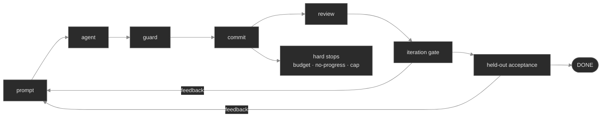

# loopkit

A self-governed coding loop you can point at any repository — the runnable form of the
agentic-loops engineering manual. You give it a goal and two gates; it drives a coding agent
toward the goal, tick by tick, with the guardrails that keep an autonomous loop from running
off a cliff: an external verification gate, a **held-out acceptance gate**, three hard stops,
durable git state, and a blast-radius safety envelope.



That's the **single-agent core**. On top of it, the `loopkit/extensions/` layer adds three
opt-in capabilities — a **supervisor** that runs many loops in parallel (blind fan-out and
evolutionary select-and-reseed), **continuous review** that gates done on a clean diff, and a
**skill write-back flywheel** so solved runs teach future ones. Each is `None`-safe: leave it
out and the core behaves exactly as above. See *Beyond one loop* below.

## Install

```bash
python3 -m venv .venv && source .venv/bin/activate
pip install -e ".[dev]"        # or: pip install -e .
```

The core is just `typer + rich + pydantic`. Everything heavy is an optional extra, imported lazily:
`[claude]`/`[openai]` (the API-adapter SDKs), `[trace]` (LangSmith tracing), `[fleet]` (Redis).
`pip install loopkit` pulls none of them; `[agents]` = both API SDKs, `[all]` = everything.

## Quickstart

Point it at a repository:

```bash
cd your-repo
loopkit init                   # scaffolds loopkit.toml + PROMPT.md
loopkit doctor                 # preflight: safe to run here? gates set? agent on PATH?
loopkit run                    # loops to the goal (use --dry-run to rehearse the control flow)
loopkit measure -n 10          # reliability: run the goal 10× → pass^k / pass@k (harness-stamped)
```

Or learn the concepts from the runnable course:

```bash
loopkit demo                   # list the scenarios
loopkit demo 9                 # Ch 9  — the held-out acceptance gate (overfitting)
loopkit demo 8                 # Ch 8  — continuous review gates done
loopkit demo 10                # Ch 10 — fan-out over isolated workers
loopkit demo 11                # Ch 11 — evolutionary search, validated
loopkit demo 17                # Ch 17 — the skill write-back flywheel
loopkit demo 20                # Ch 20 — triggers as infrastructure (a signed webhook → one run)
loopkit demo 21                # Ch 21 — the CI deployment tier (an issue → a draft PR, no cluster)
loopkit demo 24                # Ch 24 — reliability: pass^k falls while pass@k rises
loopkit learn 9                # any scenario, narrated, with pauses
loopkit demo 9 --live          # use the real claude-code agent (where a scenario supports it)
```

Chapters 20–21 are the **Part III** ecosystem labs — running the loop inside GitHub/GitLab. The
companion teaching module is [`docs/part-iii-ecosystem.md`](docs/part-iii-ecosystem.md).

## The two gates (the heart of it)

A loop that iterates against the only check it has will *overfit* that check — it makes those
exact assertions pass, which is not the same as solving the goal. So loopkit runs two gates:

- the **iteration gate** — fast, in-sample, what the loop optimizes against every tick;
- the **acceptance gate** — held-out, run once on a candidate that passed iteration, against
  checks the loop never optimized against (and may not even read).

The shipped `examples/demo-repo` is built to show this: its visible tests pass *with* a seeded
boundary bug, and only the held-out tests catch it. Run `loopkit demo 9` to watch the held-out
gate refuse to call it done.

## The whole tool is the course

Each module implements one part of the manual and is a named, swappable seam:

| Module | What it is | Chapter |
|---|---|---|
| `config.py` | the one Config object — the whole loop as one file | 18 |
| `agent.py` | the model as a subroutine — the 2×2 matrix: `claude-code`·`codex` (CLI), `claude-api`·`openai-api` (SDK), `mock` | 1–3 |
| `pricing.py` | per-model cost table → exact per-tick `cost_usd` (makes the budget stop bite) | 14 |
| `prompt.py` | fixed prompt, fresh context, anchor files | 4–5 |
| `gate.py` | the iteration gate and the held-out acceptance gate | 6–7, 9 |
| `stops.py` | the three hard stops + precedence | 13–14 |
| `durability.py` | commit every tick; state signature; resume from git | 15 |
| `safety.py` | blast-radius preflight + protected-path guard | 16 |
| `log.py` / `trace.py` | two-layer observability: payload-free logs **+** optional full-tree LangSmith traces | 14–15 |
| `loop.py` | the controller that wires them — the tick lifecycle | 1–3, 7, 13 |
| `extensions/review.py` | continuous review hook (gates done on a clean diff) | 8 |
| `extensions/orchestrate.py` | supervisor: fan-out + evolutionary, over git worktrees | 10–12 |
| `extensions/skills.py` | skill registry + gated write-back flywheel | 17 |

Terminal precedence: `DONE ▸ SAFETY ▸ BUDGET_CEILING ▸ NO_PROGRESS ▸ ITERATION_CAP`.

## Beyond one loop

The `extensions/` layer scales the single loop up without touching its contracts. The in-process
orchestration/review/skills hooks are `None`-safe Python APIs — supply them or don't; the
deployable fleet (below) adds a `loopkit fleet` CLI surface.

**Orchestration — `Supervisor`.** Runs many worker loops over independent tasks, each in its
own **git worktree**: a separate working directory backed by the one object store, so parallel
workers can't collide on files while every commit still lands recoverably in the repo. Two
strategies share that base:

- *fan-out* (`run_fleet`) — N independent tasks, each to its own isolated worker; one crash is
  contained, never sinks the fleet.
- *evolution* (`evolve`) — N attempts at the **same** goal per generation, keep the top-k,
  reseed the winner into the next generation. Critically, only a **re-validated** winner reseeds:
  best-of-N inflates the top score (the winner's curse), so the kept winner must pass a held-out
  gate it never competed on — Ch 9's lesson applied at the fleet scale.

**Continuous review — `ReviewHook`.** After each commit, a review runs on the fresh diff; a
clean review is a *precondition for done*. Green tests are not a clean diff — review catches what
the gate doesn't encode (leftover debug, smells, security), and a failing review feeds its
findings into the next tick so the agent fixes it while the producing context is fresh.

**Skill write-back flywheel — `SkillRegistry`.** A solved run is distilled into a named skill,
rendered back into future runs' prompts, so gains compound. Write-back is **gated, never
ungated**: reaching done makes a run acceptable, not automatically worth learning from — a thin
win can distill into a skill that poisons every later prompt, so only a run that clears a
write-back gate mints one. `FileSkillRegistry` persists skills as markdown, the durable flywheel.

```python
from loopkit.config import load_config
from loopkit.extensions.orchestrate import run_fleet
from loopkit.agent import build_agent

cfg = load_config("loopkit.toml")
fleet = run_fleet(cfg, tasks=[{"goal": "...", "slug": "a"}, {"goal": "...", "slug": "b"}],
                  make_agent=lambda task: build_agent(cfg.agent), max_workers=4)
print(len(fleet.done), "of", len(fleet.workers), "reached done")
```

## The deployable fleet (Chapter 12)

The same `Supervisor` graduated off the single process: each worker becomes its own **container**
(isolation goes from logical — git worktrees — to **physical**: its own filesystem, clone, and
branch), and the in-memory handoff becomes a **Redis queue**. The coordinator `LPUSH`es tasks and
polls a results hash; workers `BRPOP` a task, run `run_loop`, and `HSET` the outcome. The queue is
also the *trigger* seam — a worker is indifferent to what woke it, so a cron, a webhook, or a human
pushing one task drives the same loop.

`extensions/fleet.py` reuses the orchestrator's result shapes (`WorkerResult` / `FleetResult` /
`Candidate` / `Generation` / `EvolutionResult`) as the wire format, and **preserves the Ch 9
selection-inflation guard** at fleet scale: `evolve` keeps best-of-N, then confirms the highest-
scoring survivor that *also* passed a held-out check it never competed on (run in the worker, since
only it has the candidate's tree). Only a re-validated winner reseeds, so a lucky overfit can't
compound. The coordinator/worker logic is fully testable with **no cluster and no tokens** — against
`fakeredis` (or an `InMemoryQueue`) + a `MockAgent`.

```bash
# Local, isolated kind cluster (repo-local kubeconfig — never touches ~/.kube/config):
make fleet-up                 # create the kind-loopkit cluster
tilt up                       # build + deploy redis + 3 worker pods; port-forward redis
make fleet-run                # coordinator: blind fan-out over the queue
make fleet-evolve             # coordinator: evolutionary search (the Ch 9 guard, deployed)
make fleet-down               # delete the cluster

loopkit demo 12               # the fleet, in-process (no cluster): the teaching scenario
```

The worker's default `--adapter mock` solves the bundled demo-repo with **zero tokens**, so the
fleet goes green on `tilt up` without credentials. Swap to `claude-code` (plus a mounted key) for a
live fleet. Redis is the one optional dependency (`pip install 'loopkit[fleet]'`); the core stays
`typer + rich + pydantic`.

## Configuration (`loopkit.toml`)

```toml
goal = "Describe exactly what 'done' means."
branch = "loopkit/run"           # never main/master

[agent]
adapter = "claude-code"          # mock | claude-code | codex | claude-api | openai-api
max_cost_usd = 5.0               # budget ceiling — bites on real cost (see `loopkit doctor`)

[gate]
iteration  = "python -m pytest tests/seen -q"
acceptance = "python -m pytest tests/holdout -q"       # held-out — the fix works
# regression = "python -m pytest tests/regression -q"  # optional 2nd oracle — old behavior preserved

[stops]
max_iter = 20
no_progress_after = 3

[safety]
protected_paths = ["tests/"]     # the loop may not touch these
require_clean_tree = true
allow_branches = ["loopkit/*"]

# [trace]                          # optional LangSmith tracing (auto-on when langsmith + a key set)
# enabled = true                   # omit for auto; true/false forces it
# project = "loopkit"
```

## Use it on your own repo

loopkit isn't tied to the demo — point it at any project, sync the result to a forge, and let
issues feed the fleet. Full walkthrough: [`docs/USING-ON-YOUR-REPO.md`](docs/USING-ON-YOUR-REPO.md).

**1 · Target any repo on your machine.** The loop runs against whatever `repo` points at:
```bash
cd ~/code/my-project
loopkit init .                 # writes loopkit.toml + PROMPT.md (never overwrites)
$EDITOR loopkit.toml           # set the 4 things that matter (below)
loopkit doctor                 # preflight: branch safe? agent on PATH? gates set?
loopkit run --dry-run          # rehearse the control flow — no agent, no tokens
loopkit run                    # real run (adapter="claude-code" → solves it)
# or, without cd-ing in:  loopkit run -c ~/code/my-project/loopkit.toml --repo ~/code/my-project
loopkit measure -n 10          # how *reliably* does it solve this goal? pass^k over 10 trials
```
The four fields that define a run: `goal`, `gate.iteration`, `gate.acceptance`, `safety.protected_paths`.
(`loopkit measure` reuses them — each trial is a full isolated run graded by `gate.acceptance`, so it
needs a held-out acceptance gate set; the report is harness-stamped and `--out report.json`-able.)

**2 · Sync the result to GitHub / GitLab.** Add a `[remote]` block — the loop pushes *its own
branch* (never `main`) and opens a **draft** PR/MR when it's done:
```toml
[remote]
enabled  = true        # nothing leaves your machine unless this is true
name     = "origin"
open_pr  = true        # open a PR/MR after pushing
provider = "auto"      # auto-detects github / gitlab from the remote URL
pr_base  = "main"
draft    = true        # a human reviews + merges
```
Requires `gh` (GitHub) or `glab` (GitLab) installed and authenticated. A finished `loopkit run`
then prints `pushed loopkit/run → origin` and the PR URL. The forbidden-branch guard (Ch 16) holds
at this outward edge: a misconfigured run *cannot* push to `main`, and it never force-pushes.

**3 · Drive the fleet from issues.** Label a backlog (e.g. `loopkit`), point workers at the repo,
and the queue turns each open issue into a task on its own branch:
```bash
# workers operate on YOUR repo (host processes shown; pods are the same with a secret mount):
loopkit fleet worker --target ~/code/my-project --adapter claude-code   # run a few
# coordinator: open issues -> tasks  (issue #N -> branch loopkit/issue-N -> a PR that closes it)
loopkit fleet run --from-issues --target ~/code/my-project --label loopkit
```
The queue is the *trigger* seam (Ch 12) — a cron or webhook pushing a task drives the same loop.

## Steering files: the `.md` control surface

Every worthwhile behaviour is steered by a file you can read and edit. Deep dive:
[`docs/CONTROL-FILES.md`](docs/CONTROL-FILES.md).

| File | Steers | Chapter |
|---|---|---|
| `loopkit.toml` | the whole run: goal, gates, stops, safety, `[remote]` (the master switch) | Ch 18 |
| `PROMPT.md` | the task spec in prose — reloaded into a **fresh context every tick** | Ch 4–5 |
| `CLAUDE.md` / `AGENTS.md` | standing conventions + guardrails the agent must obey, anchored each tick | Ch 16–17 |
| `tests/seen/` vs `tests/holdout/` | the **two gates** — the in-sample check vs the held-out spec | Ch 6–7, 9 |
| `<skill>.md` (skills dir) | lessons distilled from solved runs, rendered back into future prompts | Ch 17 |

The leverage order: most steering happens in `PROMPT.md` (what to do) and the **gates** (what "done"
means) — they are the loop's goal and its grader. `CLAUDE.md`/`AGENTS.md` hold the rules that apply
to *every* task; skills accumulate what past runs learned.

## Safety defaults (Chapter 16)

loopkit is safe-by-default. It refuses to run on `main`/`master`, wants a clean tree on an
allowed branch, commits every tick to its own branch (never force-pushes), reverts and halts
if the agent touches a protected path, and stops at the budget ceiling regardless of progress.
`loopkit doctor` reports all of this before you run.

## Observability — logs + traces

Two layers, by design. **Logs** are always on and **payload-free** (`[loopkit][component]` + run id,
ids/lengths/counts only — safe to ship anywhere). **Traces** are optional and rich: enable
`loopkit[trace]` and tracing auto-activates when a LangSmith key is present, emitting a full run tree
— `loopkit run → tick → agent → llm/tool → gates` — with the human-readable input/output of every
step, all tool calls, and exact `cost_usd`/usage/model metadata on each span (the same cost
`pricing.py` feeds the budget stop). A trace backend is the one controlled place payloads belong, so
this never weakens the never-log-payloads rule.

```bash
pip install -e ".[trace]"                  # optional; pulls langsmith
export LANGSMITH_API_KEY=...               # (and LANGSMITH_PROJECT to name the project)
loopkit run                                # traces appear automatically; loopkit doctor shows status
```

It's a clean no-op without the extra/key, nests via LangSmith contextvars (no tracer threaded
through any contract), and the fleet inherits it — each worker's run traces, tagged by task id.

## Sandboxed runs (Docker)

```bash
docker build -t loopkit .
docker run --rm loopkit demo 13                       # a scenario, fully isolated
docker run --rm -v "$PWD":/work -w /work loopkit run --dry-run   # rehearse against your repo
```

The container gives you a reproducible environment and OS-level blast-radius containment. Note
the gate runs the *target project's* toolchain, so a real run against your repo needs that
toolchain (and, for a live agent, the agent binary + credentials) available in the container —
extend the image for your stack. See the Dockerfile.

## Command reference

Everything `loopkit` exposes. Run any command with `--help` for the live version.

### Core — one loop

**`loopkit init [PATH]`** — scaffold a starter `loopkit.toml` + `PROMPT.md` in `PATH` (default `.`;
never overwrites).

**`loopkit doctor`** — preflight: is this repo safe to point the loop at? Reports branch safety, the
agent (CLI binary on PATH, or API SDK + key), whether the **budget** can bite (model is priced), the
**gates**, and **tracing** status. Exits non-zero if preflight fails.
- `-c, --config PATH` — config file (default `loopkit.toml`).

**`loopkit run`** — run the loop until it reaches a terminal (DONE / a hard stop).
- `-c, --config PATH` — config file (default `loopkit.toml`).
- `--repo TEXT` — override the target repo (the config's `repo`).
- `--dry-run` — exercise the control flow with no agent (no tokens).
- `--max-iter INTEGER` — override `stops.max_iter`.
- `--force` — run even if preflight fails.
- `--sandbox` — run inside the loopkit Docker container (OS-level containment, Ch 16).
- *With `[remote] enabled`*, a DONE run then pushes its branch + opens a PR/MR.

**`loopkit demo [CHAPTER]`** — run a chapter's scenario straight through (omit `CHAPTER` to list).
- `--live` — use the real claude-code agent where the scenario supports it.

**`loopkit learn [CHAPTER]`** — the same scenarios, narrated, with a pause between beats.
- `--live` — as above.

Scenarios available: `5, 7, 8, 9, 10, 11, 12, 13, 14, 16, 17` (try `loopkit demo 9`, `loopkit demo 12`,
and `loopkit demo 14` — the 2×2 adapter matrix + real cost making the budget stop bite).

### Fleet — many loops (Chapter 12)

**`loopkit fleet worker`** — the executor: BRPOP a task, run the loop in an isolated clone, HSET the
result. Long-lived (a pod or a host process). No `--target` → the bundled demo-repo, token-free.
- `--redis-url TEXT` — Redis to drain (env `REDIS_URL`, default `redis://localhost:6379`).
- `--adapter TEXT` — `mock` (no tokens) | `claude-code` | `codex` (default `mock`).
- `--max-iter INTEGER` — per-task iteration cap (default 6).
- `--target TEXT` — repo path/URL to operate on (env `LOOPKIT_TARGET`; default demo-repo).
- `--gate-iteration TEXT` / `--gate-acceptance TEXT` — override the target's gates.
- `--name TEXT` — worker tag in logs (env `WORKER_NAME`; pods set it from the pod name).

**`loopkit fleet run`** — coordinator: enqueue tasks and collect a `FleetResult`.
- `-n, --tasks INTEGER` — how many independent tasks to fan out (default 3).
- `--redis-url TEXT` — env `REDIS_URL`, default `redis://localhost:6379`.
- `--goal TEXT` — override the per-task goal.
- `--from-issues` — source one task per open GitHub/GitLab issue.
- `--target TEXT` — repo to read issues from (default cwd; used with `--from-issues`).
- `--label TEXT` — only issues with this label become tasks.
- `--provider TEXT` — `auto` | `github` | `gitlab` (default `auto`).

**`loopkit fleet evolve`** — coordinator: evolutionary search with the Ch 9 selection-inflation
guard (keep top-k → re-validate survivors on a held-out gate → reseed only a validated winner).
- `-g, --generations INTEGER` (default 2), `-p, --population INTEGER` (default 4),
  `-k, --keep INTEGER` (default 2), `--redis-url TEXT`.

### `make` targets — cluster lifecycle (Tiltfile + kind)

The fleet runs on a **dedicated, isolated** local kind cluster; the Makefile exports a repo-local
`KUBECONFIG` for every recipe, so your other clusters are never touched.

| Target | What |
|---|---|
| `make fleet-up` | create the isolated `kind-loopkit` cluster, show its nodes |
| `make tilt-up` / `make tilt-down` | `tilt up` / `tilt down` (build + deploy redis + workers; UI on :10350) |
| `make fleet-run` | coordinator fan-out over the cluster (redis on `localhost:16379`) |
| `make fleet-evolve` | coordinator evolutionary search |
| `make fleet-nodes` | show the cluster's nodes (verifies context + repo-local kubeconfig) |
| `make fleet-down` | delete the cluster (host `~/.kube/config` was never written) |
| `make test` | the unit suite (fakeredis + MockAgent — no cluster, no tokens) |
| `make demo` | the fleet teaching scenario (`loopkit demo 12`) |
| `make help` | list targets |

Full cluster walkthrough: [`docs/tilt-fleet-plan.md`](docs/tilt-fleet-plan.md). Using it on your own
repo: [`docs/USING-ON-YOUR-REPO.md`](docs/USING-ON-YOUR-REPO.md).

## Develop

```bash
pip install -e ".[dev]"          # core + pytest + fakeredis + truststore;  add [fleet]/[claude]/[openai]/[trace] as needed
pytest -q                        # MockAgent + injected fakes; no agent binary, no SDK keys, no tokens
```

## Roadmap

**Done:** the single-agent core; the Part II library (supervisor fan-out + evolutionary Ch 10–12,
continuous review Ch 8, skill write-back Ch 17); the **dev fleet** (Redis queue, worker containers,
Tilt on an isolated kind cluster, verified live); **real-target** support — `loopkit run --repo`
/ `fleet worker --target` (any repo), `[remote]` push + draft PR via `gh`/`glab`, and
`fleet run --from-issues` (GitHub/GitLab issues → tasks); and **Part III Phase 0** — the **2×2
adapter matrix** (`claude-api`/`openai-api` + `codex` alongside `claude-code`), real per-adapter
**cost parsing** (`pricing.py`) so the budget stop bites, and a **full-tree LangSmith tracing** layer
(`trace.py`, auto-on, verified live).

**Next — a production, cloud-deployable system (Part III).** Phase 0 (adapters + cost + tracing) is
done; the next phase is the **amd64 worker image → GHCR** pipeline, then the DOKS cluster foundation,
per-run **`Job`s** + namespaces, **`CronJob`/webhook** triggers, and **Secrets** — running many jobs
in production with per-run namespacing, budget ceilings, and shipped logs/traces. Safety (Ch 16) must
hold at cloud scale: least-privilege ServiceAccounts, the pre-tool-use hook, branch-only pushes. The
full plan + current state: [`docs/part-iii-resume.md`](docs/part-iii-resume.md) and the architecture
wiki [`docs/architecture/`](docs/architecture/README.md).

Smaller enhancements: an optional **dashboard** over `FleetResult`/`EvolutionResult`; **tree-level
reseed** for `fleet evolve` (today's is prompt-level — tree-level needs the winner's tree on a
shared volume); finer fleet scoring (`_grade` → held-out pass fraction).
