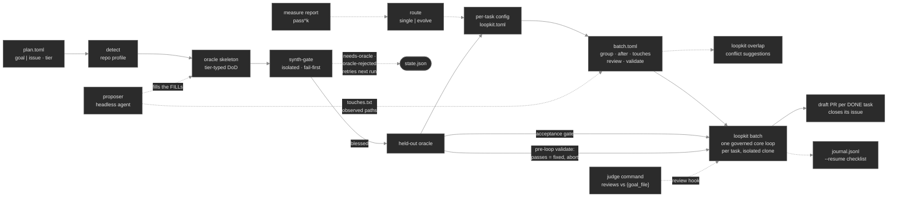

# Using loopkit on your own repo

This is the **deep reference** behind the README's Quickstart. Do the
[Quickstart](../README.md#quickstart--from-zero-to-a-merged-fix) first — it gets one goal to `DONE`
on your repo in five steps. This doc picks up where it ends: choosing good gates, working a whole
backlog, syncing to a forge, driving a fleet from issues, running in CI, and the parallel batch.
Everything outward-facing is **opt-in and off by default** — nothing leaves your machine until you
set `[remote] enabled = true`.

The mental model never changes: **a run is `goal` + two gates + a repo.** Everything else (the tick
lifecycle, durability, safety, stops) is fixed. So "use it on a new project" is really "write a
good goal and two honest gates" — which is why the rest of this section is mostly about the gates.

---

## 1. Target any repo, and choose the two gates

The Quickstart scaffolded `loopkit.toml` and set the four fields (`goal`, `gate.iteration`,
`gate.acceptance`, `safety.protected_paths`). Two things worth knowing beyond that:

**Point at a repo without editing the toml's `repo`:**

```bash
loopkit run -c ~/code/my-project/loopkit.toml --repo ~/code/my-project   # --repo overrides
cd ~/code/my-project && loopkit run                                      # or just run from inside
loopkit run --sandbox                                                    # inside the Docker image (OS-level containment)
```

**Choosing the two gates is the whole craft.** The iteration gate is what the loop optimizes every
tick — keep it fast. The acceptance gate is *held-out*: checks the loop never sees until it claims
victory, so a green iteration gate that's actually overfit gets caught (the demo-repo lesson). If
you only have one test suite, split it: put the broad/edge-case tests behind `acceptance` and a
fast subset behind `iteration`. No held-out gate → no protection against "passes the tests, wrong
behaviour."

---

## Work a whole backlog in one loop (`--plan`)

Everything above drives **one** goal to done. To hand loopkit a *checklist of requirements* for a whole
feature or project and have it work through them one at a time — committing and verifying as it goes —
scaffold **plan-driven backlog mode**:

```bash
loopkit init --plan            # writes loopkit.toml + PROMPT.md + IMPLEMENTATION_PLAN.md
```

Fill `IMPLEMENTATION_PLAN.md` with a markdown checklist (`- [ ]` per requirement), then `loopkit run`.
Each tick the loop reads the plan, does the single most important open item, verifies it against the
fast iteration gate, commits, and marks it `- [x]`. It repeats with a fresh context — the plan file is
its durable memory — until every item is checked **and** the whole-project acceptance gate passes. That
two-part condition is the point: an open item keeps the run going even when the gates are green, and a
green acceptance gate is not enough while items remain.

- **One branch, one PR.** Every item commits to the run branch; add a `[remote]` block (or
  `run --open-pr`) to land the finished backlog as a single draft PR.
- **Give it headroom, but it still can't run away.** A backlog needs a higher `stops.max_iter` than
  one task (the scaffold sets 60) and a real budget ceiling. It's also bounded by
  `stops.plan_stall_after` (scaffold: 8) — the run halts if it goes that many ticks without checking
  off *any* item, because an agent wedged on one item keeps editing files and so slips past the
  ordinary `no_progress` stop (which only watches the git tree). Raise it if your items are large.
- **This is the *sequential* shape.** For *independent* tasks in parallel (a bug queue), use the fleet
  instead (below) — a different tool: many branches at once, not one checklist in order.

### Three ways to point loopkit at work

| Shape | How | Best for |
|---|---|---|
| **One task** | `loopkit run` | a single fix or feature |
| **Sequential backlog** — one loop, ordered | `loopkit init --plan` → `loopkit run` | a coherent feature/refactor with dependent steps |
| **Parallel batch** — N loops at once | **`loopkit batch --tasks batch.toml`** (below) — or the fleet (`fleet run --from-issues`, §3) / git worktrees / the `run_fleet` Python API | a pile of *independent* tasks (a bug queue) |

The sequential backlog and the parallel batch are different tools, not the same thing: `--plan` is one
agent grinding an ordered checklist with shared state; a batch is many agents on unrelated work, one
branch each. On one machine the one-command path is **`loopkit batch`** (no Redis — see below); the
Redis fleet (§3) is for separately-deployed workers, and the raw worktree loop / `run_fleet` API
remain the manual versions.

---

## 2. Sync the result to a remote (GitHub / GitLab)

The loop is always durable locally (commit every tick). To take the finished branch *outward*, add
a `[remote]` block:

```toml
[remote]
enabled  = true          # master switch — no push/PR happens unless this is true
name     = "origin"      # the git remote to push to
push     = true          # push the loop branch on DONE
open_pr  = true          # then open a PR/MR
provider = "auto"        # auto (detect from the remote URL) | github | gitlab
pr_base  = "main"        # the base branch the PR targets
draft    = true          # open as a draft — a human reviews + merges
```

**One-off, no block:** `loopkit run --open-pr` flips `enabled` + `open_pr` for a single run — the
same switch a static `[remote]` sets. It's how the CI tier (§4) opens its draft PR without keeping a
`[remote]` block in the repo's config.

**Prerequisites** (loopkit shells out to these — no Python SDK dependency):

```bash
gh auth status      # GitHub: `brew install gh && gh auth login`
glab auth status    # GitLab: `brew install glab && glab auth login`
```

Now a finished run ends with:

```
pushed loopkit/run → origin
opened PR https://github.com/you/my-project/pull/123
```

**Safety at the outward edge.** The same Ch 16 guard that stops the loop committing to `main` stops
it *pushing* to `main`: `push_branch` refuses any branch in `safety.forbid_branches`, and it never
force-pushes. The PR is a **draft** by default — loopkit proposes, a human disposes.

---

## 3. Drive the fleet from issues

Turn a labelled backlog into the fleet's work queue. Each open issue becomes a task on its own
branch (`loopkit/issue-<N>`); solve it, and (with `[remote]`) the PR that lands **closes the issue**.

There are two roles, and they're separate on purpose (the queue decouples *what* from *how*):

- **Workers** (the executors) — started with `--target` so they operate on your repo.
- **The coordinator** (`fleet run --from-issues`) — reads issues and enqueues them.

### Host-process flow (simplest — your machine, your git creds, no cluster)

```bash
# 1. label the issues you want automated:  add the `loopkit` label on GitHub/GitLab
# 2. start a few workers pointed at your repo (each its own process):
for i in 1 2 3; do
  loopkit fleet worker --target ~/code/my-project --adapter claude-code --name w$i &
done
# 3. coordinator: open issues -> tasks -> the workers solve them
loopkit fleet run --from-issues --target ~/code/my-project --label loopkit
```

This needs a Redis to connect through — either the Tilt fleet (`make fleet-up && tilt up`, redis on
`localhost:16379`, pass `--redis-url redis://localhost:16379`) or any local redis. The workers pull
each issue, run the loop on a clone, and — if the repo's `[remote]` is enabled — push the branch and
open a PR that closes the issue.

### On the kind/Tilt cluster (pods)

Same commands, but the worker `Deployment` (`k8s/worker.yaml`) sets `--target` and the pods need
two things mounted that the host has for free:

- **The target's toolchain** — gates run the project's test commands, so extend the worker image
  (the `Dockerfile`) for your stack (Node, Go, …); it ships Python + pytest today.
- **Git credentials** to clone (if private) and push — mount a token as a Kubernetes `Secret` and
  expose it to `git`/`gh` (e.g. `GH_TOKEN`, or a `~/.git-credentials` file). Treat it like any
  production secret; never bake it into the image.

> The bundled demo (`--adapter mock`, no `--target`) needs none of this — it's the token-free,
> credential-free smoke test. The two mounts above are what graduate it to a real project.

---

## 4. Hands-off in CI (no cluster)

The lowest-friction way to put loopkit on a real repo is the **CI deployment tier**: a labelled issue
starts a CI job that runs one `loopkit run` and opens a **draft** PR — the forge is the trigger, the
secret store, the identity, and the sandbox, so there's no infrastructure to operate.

```bash
loopkit init --ci github     # scaffold .github/workflows/loopkit.yml (or: --ci gitlab → .gitlab-ci.yml)
# add the repo secret ANTHROPIC_API_KEY, edit the two gates in loopkit.toml, commit
# then open an issue, add the `loopkit` label, and watch a draft PR appear
```

Under the hood the job runs `loopkit run --from-event "$GITHUB_EVENT_PATH" --adapter claude-api
--open-pr` (GitHub) or `--from-issue "$ISSUE_IID" --provider gitlab …` (GitLab). The full how-it-works
+ the GitHub-vs-GitLab differences + the runnable labs (`loopkit demo 20`/`21`) are in the teaching
module **[`part-iii-ecosystem.md`](part-iii-ecosystem.md)**; the templates live in
[`../examples/ci/`](../examples/ci/).

---

## Parallel on one machine (`loopkit batch`)

The fleet (§3) is the issue-driven, Redis-backed path for separately-deployed workers. On one box,
the one-command path is **`loopkit batch`**: a TOML manifest of tasks → N concurrent loops, each in
its own isolated clone on its own branch, each with its own config — no Redis, no worker processes
to start.

```toml
# batch.toml — [defaults] + one [[task]] per piece of work
[defaults]
config = "base.loopkit.toml"        # tasks without their own config inherit this one
review = "bash gate/llm-judge.sh"   # optional: REPLACE the built-in default judge for EVERY task
                                    # (review is on by default — this swaps the judge, not enables it)

[[task]]
id = "clamp-limit"
issue = 42                          # goal from the forge issue (or set `goal = "..."` directly)

[[task]]
id = "fix-total"
goal = "return the real result count, not 0"
config = "configs/fix-total.toml"   # per-task gates / budget / protected-path unlocks
group = "handlers"                  # serialize with other members (they touch the same files)

[[task]]
id = "fix-sort"
goal = "stable sort for tied scores"
group = "handlers"                  # runs after fix-total, never concurrently with it

[[task]]
id = "require-key"
goal = "the consumer requires the service key"
after = ["clamp-limit"]             # a true dependency: skipped (not run) if it fails
```

```bash
loopkit batch --tasks batch.toml --dry-run     # print the resolved schedule, run nothing
loopkit batch --tasks batch.toml --jobs 3 --open-pr
```

Two scheduling fields cover the two ways related fixes collide: **`group`** serializes tasks in
manifest order (predicted file conflicts, a shared test DB — mutual exclusion, not a dependency),
and **`after`** encodes real dependencies (a task whose dependency misses DONE is **skipped**, and
skips cascade). Everything else runs concurrently up to `--jobs`. Each task ends with an outcome in
the summary table (and `--out results.json`); with `[remote]`/`--open-pr`, each DONE task lands its
own draft PR — one human review pass over the whole batch. `loopkit demo 28` is the runnable lab.

Long batches are supervisable and restartable: every outcome prints a one-line progress entry as
it lands (`done fix-total · 3 iters · $2.10 · 5/20 finished`) **and** appends to a journal next to
the manifest (`batch.toml.journal.jsonl`) the moment it finishes — a crash-proof checklist. If the
batch dies at task 14 of 20, `--resume` reads the journal and skips everything already DONE;
failures and skips re-run (the same successes-skip/failures-retry semantics as `mold-batch`).

For a batch that doesn't *have* per-task configs and oracles yet, `loopkit mold-batch` builds them
(detect → tier-typed oracle → fail-first verification → configs → a ready `batch.toml`) — see the
molding kit ([`part-iv-molding-kit.md`](part-iv-molding-kit.md), `loopkit demo 29`). The plan's
`review`/`validate` commands ride through to the emitted manifest with **mold-context placeholders**
filled per task — `{task_id}`, `{goal_file}`, `{oracle_dir}` — so a judge can review each change
against the molded goal and tier assertion, not just the raw diff. And when a task declares no
`validate`, mold auto-wires one from its own blessed oracle (`! <oracle>`): the oracle proved it
FAILS on the buggy tree, so an oracle that *passes* pre-run means "already fixed" — the loop aborts
before spending a token. Set `validate = ""` to opt a task out.

#### The pipeline at a glance

Solid = the mechanical path every task takes. Dotted = optional or advisory: the proposer (skip it
and FILL the skeletons by hand), the reliability report (skip it and route says "uncalibrated"),
overlap (analysis, never a gate), the judge *override* (the built-in judge reviews every task by
default; the dotted command swaps in your own),
and the journal (always written; consulted only by `--resume`). The honest stops are first-class:
a task the kit can't verify goes to `state.json` and retries next run — it never fakes judgment.



The core loop each task runs is the README's own diagram — prompt → agent → guard → commit →
iteration gate → review → acceptance → DONE — unchanged; molding only *supplies* its quality
policy: the blessed oracle becomes the held-out acceptance gate, the derived `! oracle` check
guards entry, and the review hook carries the built-in default judge (or a configured judge
command, with the molded goal as its rubric).

### Which tasks will collide? (`loopkit overlap`)

`group` and `after` are yours to declare — but on a 20-task batch, *knowing* which tasks step on
the same files is the hard part. **`loopkit overlap`** derives it: each task's **predicted-touch
set** is intersected pairwise, and the pairs the manifest doesn't already cover get suggestions.

Touch data comes cheapest-first: an explicit `touches` field on the task, else repo-relative path
tokens (`dir/file.ext`) lifted straight out of the goal text — well-written goals and forge issues
cite the files they're about, so the zero-config tier usually just works. A task with neither is
reported **unanalyzed**, never silently assumed conflict-free.

Molding adds a third source for free: the `mold-batch` proposer is already exploring the repo to
write the oracle, so it may drop the source paths it expects the fix to touch into
`$MOLD_TOUCHES_FILE` (one per line) — **observed** touch data, no keywords to curate, riding the
emitted `batch.toml` automatically. A human-declared `touches` always wins over the observation.

```toml
[[task]]
id = "fix-total"
goal = "return the real result count, not 0 (src/handlers/search.go)"   # paths lift from text

[[task]]
id = "clamp-limit"
goal = "cap the page size"
touches = ["src/handlers/search.go"]   # or declare them explicitly — highest trust
```

```bash
loopkit overlap --tasks batch.toml     # works on a mold plan.toml too (extra keys ignored)
```

```text
predicted overlaps
  fix-total ↔ clamp-limit   src/handlers/search.go   declared? no

suggestions (copy into the manifest — advisory, edit freely):
  [[task]] id = "fix-total"    →  add: group = "search"
  [[task]] id = "clamp-limit"  →  add: group = "search"
merge-order hint (manifest order): fix-total → clamp-limit
```

Three things it deliberately is **not**: it never blocks (a missed conflict costs one rebase at
merge time; a false serialization would tax every future batch — so exit 0, always); it never
edits your manifest (suggestions are copy-paste lines, the declaration stays yours); and it isn't
only about scheduling — tasks run in **isolated clones**, so overlapping tasks collide at **merge
time**, which is why every overlap cluster also gets a merge-order hint. `batch` itself re-runs the
analysis after fetching issue-sourced goals and prints a one-line warning per undeclared overlap —
so even a manifest that never met `overlap` gets the advisory for free at `--dry-run`.

### The manual version (git worktrees)

For a quick hand-rolled "run N goals at once" — or to understand what `batch` automates — give each
run its own **git worktree**: a checkout has exactly one branch, so parallel runs can't share one.
One worktree = one branch = one loop. (From Python, the same thing is
`run_fleet(tasks=[…], max_workers=N)` — N loops in-process, no Redis.)

```bash
for slug in featA featB featC; do
  git worktree add -b "loopkit/$slug" "../wt-$slug" HEAD
  ( cd "../wt-$slug" && loopkit run --repo "../wt-$slug" \
       --branch "loopkit/$slug" -c "../$slug.toml" ) &     # one config per goal (or --from-issue N)
done
wait
# review each on its branch, merge the winners, then:  git worktree remove ../wt-<slug>
```

Each worktree commits to its own branch; you review and merge the good ones. Mind the worktree/parallel
sharp edges in **Gotchas** below (gitignored files, clean-tree, gate `cwd`, shared-file conflicts).

---

## Gotchas

- **The gate runs the target's toolchain.** A real run needs that toolchain present (locally, or in
  the worker image). `loopkit doctor` checks the agent binary, not your test runner.
- **`--from-issues` finds nothing?** Check `gh issue list --label loopkit` works in that repo, that
  the label exists, and that `gh`/`glab` is authed. Empty queue → the coordinator exits with a note.
- **Workers and coordinator must agree on the repo.** `fleet run --target X` enqueues issues from
  `X`; the workers must have been started with `--target X` too, or they'll run the wrong project.
- **Private repos in pods** need the clone credential mounted, not just the push one.
- **`loopkit run` checks out the config's `branch` in the target tree — even with `--dry-run`.** Point
  it at your working checkout and it switches that checkout to `loopkit/…`. Use a worktree (above) to
  keep your main checkout put, or `git checkout -` afterward.
- **A fresh worktree/clone doesn't have your *gitignored* files.** If a gate script, config, or rubric
  lives under a gitignored path it won't exist in a new worktree — symlink it in, or keep it tracked.
  (Tracked is also what CI clones need and what `protected_paths` needs: that guard is *git-diff based*,
  so it can't protect a gitignored file and won't see one on a clone.) When you symlink a **directory**,
  note a gitignore directory pattern (`foo/`) does *not* match a *symlink* named `foo`, so the untracked
  symlink trips `require_clean_tree` — add it to `.git/info/exclude`.
- **Write gates to grade the *workspace*, not their own location.** loopkit runs a gate with `cwd` set
  to the workspace, so derive the repo root from `$PWD` (`git rev-parse --show-toplevel`) — then one
  gate, symlinked into every worktree, grades each worktree instead of the original repo.
- **Parallel runs that all edit one shared file conflict on merge.** If every run touches a common
  status/changelog/index file you get N-way conflicts. Have the agent confine changes to its own
  artifact and do the shared-file update in a single pass after merging.
- **Size `max_cost_usd` for more than one tick.** A budget that barely covers a single author-tick
  can't iterate against gate feedback — leave room for the acceptance check plus at least one fix-tick.
  (The budget stop halts *starting a new tick*; it won't abort a candidate that reaches DONE mid-tick.)

See also: [`CONTROL-FILES.md`](CONTROL-FILES.md) for the `.md` files that steer each run, and
[`archive/part-ii-tilt-fleet-plan.md`](archive/part-ii-tilt-fleet-plan.md) for the cluster bring-up.
