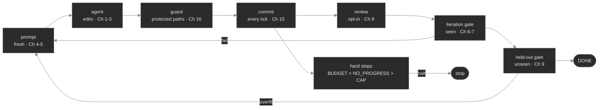
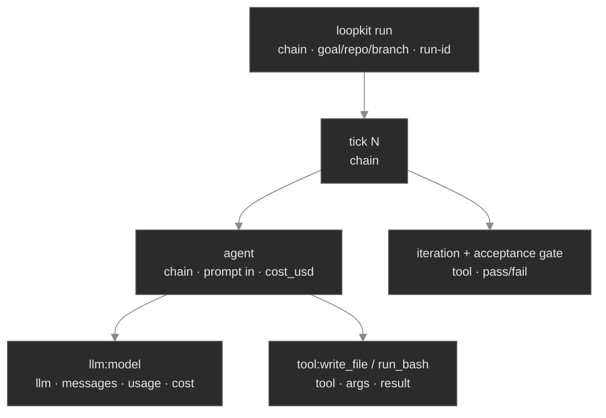
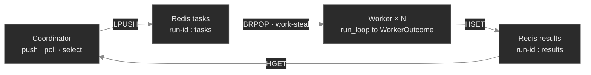

# 01 — The system today (Built 🟢)

What exists, tested, in `main`: the single-loop **core**, its **contracts**, the `None`-safe
**extension seams** (orchestration, review, skills), and the **queue-driven fleet** — both
in-process and on a dev kind/Tilt cluster. This page is the structural reference; for the working
log of how it got here, see [`../part-ii-resume.md`](../part-ii-resume.md).

Architecture mirrors the agentic-loops curriculum, one module per concern:

```
config.py(18)  agent.py(1-3)  pricing.py(14)  prompt.py(4-5)  gate.py(6-7,9)  stops.py(13)
durability.py(15)  safety.py(16)  loop.py(controller)  cli.py  log.py  trace.py(observability)
extensions/{orchestrate,review,skills,fleet,remote,issues}.py   scenarios/   examples/demo-repo/
```

## The tick spine

`loop.run_loop` is the controller. One tick:



**Terminal precedence is `DONE > SAFETY > BUDGET > NO_PROGRESS > CAP`**, and the order is
load-bearing, not cosmetic. It encodes a safety lattice: a genuine completion (`DONE`) is honored
first; a safety violation (`SAFETY`) preempts any "success" so a loop can never declare victory by
touching something it must not; budget preempts progress heuristics so cost can't be out-run by an
agent that keeps "looking busy"; no-progress preempts the raw iteration cap so a stalled loop dies
on its stall, not on the clock. Evaluating in any other order would let a lower-severity terminal
mask a higher-severity one.

**Fresh context every tick** (`prompt.build_prompt`, Ch 4–5): the prompt is rebuilt from durable
anchors (goal, the repo's `PROMPT.md`, the last gate/review feedback, the rendered skills) rather
than an ever-growing transcript. The principle is that an autonomous loop's reliability degrades
with context length and accumulated dead-ends; reconstructing from anchors keeps each tick on a
clean, bounded footing and makes the loop resumable from git state alone.

## Core contracts

The loop depends on **abstractions, not implementations** (dependency inversion) — which is exactly
what lets the same `run_loop` run a mock agent in a unit test, a real coding-agent CLI on your
laptop, and a worker pod on a cluster, with no change to the controller.

| Contract | File | Role | Implementations |
|---|---|---|---|
| `Agent` | `agent.py` | Make edits toward the goal this tick | the **2×2 matrix** — `claude-code`/`codex` (CLI) + `claude-api`/`openai-api` (SDK) + `mock`; per-tick cost via `pricing.py` — see [`03`](03-adapters-and-auth.md) |
| `Gate` | `gate.py` | Verify work via an external command's exit status | `ShellGate`, `CallableGate` |
| `Store` | `durability.py` | Durable, resumable state | git commit-every-tick + `state_signature` |
| `StopPolicy` | `stops.py` | Terminal conditions independent of the goal | budget, no-progress, cap |

`MockAgent` is not a toy — it is the **test substrate that keeps the whole system runnable with zero
tokens**. Every scenario and unit test drives the real control flow with a scripted agent, which is
why CI, demos, and the green dev fleet cost nothing. Preserve this: new behavior lands with a
`MockAgent`-driven test, never a live-token one.

## The held-out acceptance gate — the anti-overfit core (Ch 9)

Two gates, deliberately asymmetric:

- The **iteration gate** is the loop's working signal — the agent can see it and run it (the seen
  tests). It tells the agent whether it's getting warmer.
- The **held-out acceptance gate** is a check the agent **never sees and never runs** (the holdout
  tests). `DONE` requires it to pass.
- An **optional held-out regression gate** (`gate.regression`, None-safe) is the *second oracle*
  (SWE-bench's FAIL_TO_PASS + PASS_TO_PASS): acceptance proves the *target* works, regression proves
  *previously-passing* behavior was preserved, so a fix that passes its target by breaking something
  else fails. Unconfigured ⇒ acceptance alone certifies (exact prior behavior). See the field mapping
  in [`../part-iii-prior-art.md`](../part-iii-prior-art.md).

The principle is the generation–verification gap exploited in reverse: any signal an optimizer can
observe, it can overfit to (reward-hacking, "memorizing the visible tests"). A gate kept *out* of
the optimization loop is the only kind whose pass is evidence of real generalization. The bundled
`examples/demo-repo` is a runnable proof: a bulk-discount boundary bug where the seen tests pass but
the held-out tests catch the off-by-one — `demo 9` shows the loop being saved by the held-out gate.

The **agent's tool surface is an ACI** (agent-computer interface), not a thin wrapper: `write_file`
refuses a syntactically-broken `.py`/`.json` edit at the boundary (the bad state never lands), and a
failing gate's output is **shaped** into the failing lines + the summary tail, budget-bounded, rather
than a blind dump that burns the budget stop. These are SWE-agent / Anthropic ACI lessons — see
[`../part-iii-prior-art.md`](../part-iii-prior-art.md).
This same guard reappears at every layer above (evolutionary selection, the fleet) and must never be
weakened into "just run more of the same judge."

## Safety envelope (Ch 16) — `safety.py`

Blast-radius containment, enforced before the loop ever runs and on every commit:

- **Preflight** (`doctor` / `run` startup): refuses to operate on a dirty tree or the default branch;
  confirms gates are set and the agent is on `PATH`.
- **Gate-determinism preflight** (opt-in, `safety.gate_stability_runs` / `run --check-gate N`): runs
  the iteration gate N times on the *unchanged* initial tree and refuses to start unless every run
  agrees. A gate that flips verdict on identical state corrupts every stop decision the loop makes —
  it "fixes" correct code or halts on broken code — so a flaky gate is worse than no gate (Ch 9). The
  verdict need not be *pass* (a loop legitimately starts red), only *stable*. Default off ⇒ exact
  prior behavior; `safety.gate_stability(gate, tree, runs)` is the reusable check.
- **Protected-path guard**: a pre-commit check that fails the tick if the agent touched a protected
  path (e.g. `tests/`) — the agent cannot "fix" the test that judges it.
- **Branch allowlist**: pushes are confined to an allowed pattern (e.g. `loopkit/*`); never `main`.
- **Budget ceiling**: a hard cost stop (`stops.py`).

At cloud scale this envelope is extended, not replaced — see [`04-security.md`](04-security.md).

## Durability (Ch 15) — `durability.py`

**Commit every tick.** Each tick that changes the tree commits, so the loop's state *is* git state:
crash-resumable, inspectable, and revertable per tick. `state_signature` (a hash of the tree)
feeds the **no-progress** stop — if the signature doesn't move across N ticks, the loop is stalled
and dies on the stall rather than burning the full iteration cap. Sharp edges already paid for:
`git status` collapses new untracked dirs (use `--untracked-files=all`), and Python gates litter
`__pycache__` into protected paths (gates run with `PYTHONDONTWRITEBYTECODE=1`).

## Observability — two layers: logs + traces

Observability is deliberately split, and the split is the design:

- **Logs (`log.py`) — always on, payload-free.** One greppable line per event (`[loopkit][component]`
  + run id, `key=value`, **ids/lengths/counts only, never payloads**). Safe to ship anywhere. This is
  the flight recorder that answers "what happened" in aggregate.
- **Traces (`trace.py`) — optional, full-tree.** When enabled, a LangSmith run tree mirrors the tick
  spine: `loopkit run → tick → agent → llm/tool → gates`, with the **full human-readable input/output,
  every tool call, and organized cost/usage/model metadata** on each span. A trace backend is the one
  controlled place payloads belong, so it does **not** weaken the never-log-payloads rule. This answers
  "what happened in *this* run, step by step, and what did each step cost."



**Three properties make it safe to leave wired in unconditionally:** `langsmith` is an optional
extra (`loopkit[trace]`) imported lazily, so importing `trace.py` never pulls it; tracing
**auto-activates** only when `langsmith` + a LangSmith key are present and is otherwise a cheap
**no-op**; and the API adapter's `llm`/`tool` spans **nest via LangSmith contextvars** under whatever
span the loop has open — no tracer object is threaded through the `Agent` contract. Cost on each span
is exact, computed by `pricing.py` from native token usage — the same number that feeds the budget
stop. The fleet inherits all of this: each worker runs `run_loop`, so its runs trace too (tagged by
task id). *Dev-only sharp edge:* behind a corp TLS-intercepting proxy (Zscaler), the LangSmith
uploader needs the OS trust store — `trace.py` injects `truststore` if it's importable (a **dev-only**
dependency; absent in prod, where standard TLS works).

## Extension seams — `None`-safe opt-ins

The core keeps **no runtime dependency** on `loopkit/extensions/` (open/closed principle). Every
extension attaches at a keyword-only, typing-only-imported, duck-called, `None`-safe seam — passing
`None` reproduces exact v1 behavior. This is the rule any new attach point must follow.

| Extension | File | Seam | What it adds |
|---|---|---|---|
| **Orchestration** (Ch 10–12) | `orchestrate.py` | wraps `run_loop` as a worker body | `Supervisor` over git-worktree workers: blind **fan-out** + **evolutionary** select-and-reseed |
| **Continuous review** (Ch 8) | `review.py` | `run_loop(review_hook=…)`, after a real commit | gates `DONE` on a clean diff; a failing review skips the gate block and feeds findings to the next tick |
| **Skills flywheel** (Ch 17; git home Phase 5b) | `skills.py` | `build_prompt(skills=…)` read edge + `run_loop` DONE write edge | render learned skills into the prompt; **gated** write-back on `DONE` so solved runs teach future ones. Three storage tiers, one Protocol: `InMemory` → `File` (durable on one fs) → **`GitSkillRegistry`** (Part III: durable across machines via a `loopkit-skills` git repo — clone at start, gated push on `DONE`, rebase-retry for concurrent pods) |
| **Remote sync** | `remote.py` | post-`DONE` in `run` + the worker runner | push branch (never force, refuses forbidden branches) + optional **draft** PR/MR via `gh`/`glab` |
| **Issue tasks** | `issues.py` | `fleet run --from-issues` | `gh`/`glab issue list` → tasks (goal = title+body, branch `loopkit/issue-N`, issue # rides to the PR) |

**Evolutionary selection** carries the Ch 9 guard up a level: keep best-of-N per generation, but
only a candidate that **re-passes the held-out gate it never competed on** may reseed the next
generation. `test_selection_inflation_is_caught_by_revalidation` proves the 1.0-score "memorizer"
loses to the 0.9 "solver" that generalizes.

**Reliability measurement (`pass^k`).** `extensions/measure.py` + `loopkit measure` answer the question
`evolve` doesn't: not *can* the loop solve a goal (discovery), but *how reliably*. It runs a goal N
times as independent trials through the fleet's `TaskRunner` seam — each a full isolated `run_loop`
graded by the held-out gate, so a trial passes only on `DONE` — and reports two curves: **`pass^k`**
(reliability — *all* k trials pass, `C(c,k)/C(n,k)`, **falls** with k; the production metric) and
**`pass@k`** (discovery — *any* of k, `1−C(n−c,k)/C(n,k)`, rises with k; what `evolve` banks on). The
`ReliabilityReport` is **harness-stamped** (loopkit version + a signature over gates/adapter/model/
iter-cap + a timestamp) and JSON-serializable, because a number without its harness isn't a
measurement. It also carries **`cost_per_accepted`** — total spend over the trials the held-out gate
*accepted* (`None` when none were, undefined ≠ zero) — the economically honest unit cost: tokens spent
and trials attempted flatter you; what ships is what was accepted (the cost axis of the open
measurement layer). `demo 24` shows reliability collapsing while discovery climbs. This is the first
brick of the *open measurement layer* ([prior-art](../part-iii-prior-art.md)).

## The fleet — queue-driven across containers (Ch 12) 🟢

`extensions/fleet.py` graduates the in-process `Supervisor` to a deployed fleet. The change is one
of *isolation* and *transport*:

- **Isolation goes physical.** A worker is its own container with its own filesystem; it clones the
  target into `tempfile.mkdtemp` on its own branch, so collisions are structurally impossible — no
  worktree machinery.
- **Transport goes through Redis.** The in-memory `Future` becomes a `Queue` Protocol with two
  implementations under one contract: `RedisQueue` (`LPUSH`/`BRPOP` a task list, `HSET`/`HGET` a
  results hash) and `InMemoryQueue` (a dependency-free `deque`+`Condition` fake for scenarios/tests).



Key design facts to preserve:

- **`BRPOP` makes Redis the work-stealing dispatcher for free.** It blocks (no busy-poll) and it
  *pops*, so two workers never get the same task. **Replicas/parallelism is the only throughput
  knob** — adding workers adds throughput with no coordinator change.
- **`WorkerOutcome`** is the flat, JSON-able wire form of the in-process `WorkerResult`/`Candidate`
  shapes — a container can't hand back a live `RunResult` or a `Path` to a filesystem it no longer
  has, so the result is reduced to scalars and rebuilt coordinator-side.
- **The selection-inflation guard is preserved by *relocating where it runs*, not weakening it.**
  The held-out re-validation must run **in the worker** (only it has the candidate's tree); it rides
  back as `WorkerOutcome.revalidated`, and the coordinator applies the identical rule — walk
  survivors high-score-first, take the first that passed held-out. Same *outcome* as
  `Supervisor.evolve`; only the *location* of the gate moves.
- **One crash is contained to one `error` outcome** (`Worker._handle`), so a bad task can't sink the
  pod. The **task id is the correlation id** on every `[loopkit][worker]` line it touches.
- **`make_repo_runner`** is the worker's real task runner for *any* repo (the demo runner is a thin
  wrapper pinned to `examples/demo-repo`): materialize the repo (clone/copy), `run_loop` on the
  task's branch, grade the terminal, and — if the repo's `[remote]` is enabled — push + open a PR.

## The dev cluster fleet (kind / Tilt) 🟢

A proven local deployment, the launchpad for Part III. `make fleet-up` creates an **isolated**
`kind-loopkit` cluster against a **repo-local `KUBECONFIG`** (the host `~/.kube/config` is never
touched — the isolation guarantee); `tilt up` deploys `k8s/redis.yaml` + `k8s/worker.yaml` (a 3-pod
worker `Deployment`) with a `custom_build` that side-loads the image (Docker 29's containerd store
breaks `kind load docker-image`); the coordinator runs on the host against a port-forwarded Redis on
**:16379**. The `Tiltfile` pins `allow_k8s_contexts('kind-loopkit')` + `fail()` — the context guard
Part III extends to a real cloud context. Full runbook + sharp edges:
[`../tilt-fleet-plan.md`](../tilt-fleet-plan.md) and [`../part-ii-resume.md`](../part-ii-resume.md).

**Where this stops, and why Part III exists:** the coordinator runs on the host (not in-cluster),
workers are a fixed long-lived `Deployment`, the image arrives via `kind load` (no registry), Redis
is ephemeral, there are no Secrets, no scheduling, no multi-tenancy. The next page is the design
that closes that gap. → [`02-cloud-architecture.md`](02-cloud-architecture.md)
