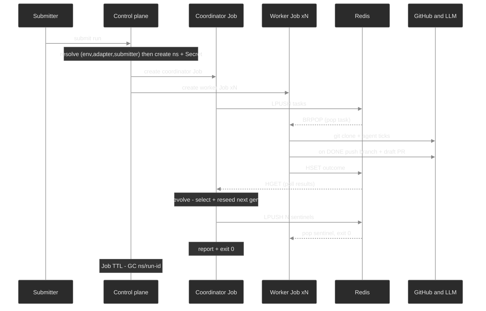

# 02 — Cloud architecture, Part III (Designed 🟡)

The target system: loopkit **deployed to a managed cloud cluster (DigitalOcean DOKS), running many
jobs in production** — concurrent, scheduled, and event-triggered — with the Ch 16 safety envelope
holding on a shared, multi-tenant cluster. This page is the design; the build sequence and current
status are in [`../part-iii-resume.md`](../part-iii-resume.md).

It builds directly on the [dev cluster fleet](01-system-today.md#the-dev-cluster-fleet-kind--tilt-),
closing its gaps: in-cluster coordinator, elastic workloads, a real registry, Secrets, scheduling,
and tenancy.

## Design goals & the central principle

Goals: **many concurrent independent runs**, **scheduled/recurring** runs, **webhook/event-triggered**
runs, and **parallelism of a few to a few dozen** workers per run — with strong per-run isolation and
real cost control.

The load-bearing principle is **decoupling the *run* lifecycle from *worker capacity*, and choosing
ephemeral per-run Jobs for siloing.** A "run" is the logical + accounting unit (one target, one
goal-set, one budget, one result); worker pods are disposable compute. Binding each run to its own
short-lived Kubernetes `Job` + namespace buys three forms of isolation that a shared long-lived
worker pool cannot:

1. **Accounting & cost** — a run lives in its own namespace with its own quota, its own Secrets, and
   its own budget; `kubectl delete ns/run-<id>` ends it cleanly.
2. **Failure** — a crash-looping run fails only itself (and Kubernetes retries it via `backoffLimit`);
   a shared pool's crash poisons every run at once.
3. **Lifecycle/cost-at-rest** — runs scale to **zero** between submissions; no idle worker pool.

(Filesystem isolation is *not* a reason to prefer Jobs — every worker already clones into its own
pod filesystem either way. The siloing Jobs add is in accounting, failure, and lifecycle.)

## Namespace layout

```
ns/loopkit-system   (long-lived, shared infra)
  ├─ StatefulSet redis-0 + PVC        queue + results, AOF-durable, per-run keyspaces
  ├─ Deployment webhook-listener      push/PR/issue → create_run()   (+ DO LoadBalancer)
  ├─ ServiceAccount loopkit-control   the only SA permitted to create run namespaces/Jobs/Secrets
  └─ Secret sources (per env/adapter/engineer)   resolved + copied into each run ns

ns/run-<id>         (ephemeral, one per run, TTL-GC'd)
  ├─ Job coordinator    enqueue → collect → select → sentinel → report → exit
  ├─ Job worker         parallelism N; BRPOP → clone → run_loop → push → HSET; exit on sentinel
  ├─ Secret loopkit-creds   git creds + the resolved agent key (mounted into pods only)
  ├─ ResourceQuota + LimitRange   loose to start; tightenable later
  └─ emptyDir scratch (per worker pod)   clone target here; no PVC
```

## Run lifecycle

A run, end to end (the three submit paths all converge on `create_run()`):



Two mechanics are load-bearing:

- **The "fine-grained work-queue Job" pattern.** The worker Job sets `parallelism: N` with
  `completions` unset; pods drain the shared queue and exit `0`. This is the canonical Kubernetes
  pattern for queue-backed batch — throughput scales with `N`, `backoffLimit` retries a crashed pod,
  and `ttlSecondsAfterFinished` cleans up. `Worker.run_forever` already has the `max_tasks` + `stop`
  hooks; the only addition is a **drain-then-exit-on-sentinel** mode.
- **Sentinel shutdown — the coordinator owns "the run is over."** Rather than guess from a
  momentarily-empty queue, the coordinator enqueues `N` poison-pill tasks when the run truly
  completes; each worker exits `0` on one. This is **required for `evolve`**: workers must survive the
  gaps *between* generations, so "exit when the queue looks empty" would be a correctness bug. The
  coordinator already drives the generational loop, so it is the right owner of run completion.

**Why a coordinator Job at all (vs. enqueue-at-submit):** fan-out alone could enqueue at submit time,
but `evolve` needs a stateful driver across generations (collect → select with the held-out guard →
reseed). Keeping a thin transport-only coordinator Job uniform across both modes is simpler than two
code paths, and it cleanly owns sentinel shutdown.

## Storage model — almost nothing is persistent, by design

The cost-and-complexity win here is recognizing how little needs to survive a pod.

- **Worker scratch = `emptyDir`** (node-local, ephemeral, free). loopkit's durability model already
  **pushes the branch + opens the PR on `DONE`** — once the work is on GitHub, the pod filesystem is
  garbage. No per-Job PersistentVolumeClaim means no DigitalOcean block-volume churn, no hourly
  minimums, no provisioning latency. Set a `sizeLimit` so a runaway clone can't fill the node.
  - **A shared long-lived PVC across workers is ruled out by a hard DO constraint:** DO block storage
    is **ReadWriteOnce** — a single volume can't be mounted by pods across nodes. RWX would need
    DO's managed NFS/filesystem; not worth standing up for disposable scratch.
- **Redis StatefulSet + one PVC, with AOF.** The only in-cluster durable state is the queue +
  results. The dev Redis is intentionally ephemeral (`--save "" --appendonly no`); **production must
  enable AOF** (`--appendonly yes` + the PVC) so a Redis pod restart doesn't drop the results hash
  mid-run and waste paid tokens. Each run uses a distinct **Redis keyspace** (`RedisQueue(namespace=
  run-<id>)` already keys `{ns}:tasks`/`{ns}:results`) so one shared Redis serves every run with no
  cross-talk; the coordinator deletes the keyspace (or sets a TTL) on finish.
- **Skills flywheel = a dedicated `loopkit-skills` git repo.** The one piece of cross-run *learned*
  state lives as `.md` files in its own GitHub repo: workers clone/pull it at start
  (`FileSkillRegistry`) and push **gated** write-backs on `DONE`. Git-native, versioned, reviewable,
  zero new infra, reuses the existing GitHub auth.

## Control plane — one path, three entry points

CLI, CronJob, and webhook listener **all converge on a single `create_run()`** (build `ns/run-<id>`
+ Secrets + coordinator Job + worker Job). Three triggers, one code path — the factoring that keeps
behavior identical no matter how a run starts.

**`loopkit cloud` talks to the Kubernetes API via the official Python client** (behind a
`loopkit[cloud]` extra). This is the *cloud-agnostic* choice: the client speaks the k8s API, which
is identical across DOKS/EKS/GKE/kind — nothing DO-specific — and the *same* `create_run()` runs in
three places with auth auto-detected: laptop/CI via kubeconfig (`load_kube_config`), and the
webhook-listener + CronJob pods via in-cluster ServiceAccount (`load_incluster_config`). So
submissions **never depend on one engineer's machine**: the in-cluster triggers stand alone, and the
CLI is a convenience client usable anywhere.

The CLI surface (the "simple management system"):

```bash
loopkit cloud bootstrap                                 # one-time: ns/loopkit-system, Redis, listener, RBAC
loopkit cloud register <repo> --env … --adapter …       # target ConfigMap: gates, budget, workers, key map
loopkit cloud run --target <repo> [--goal G | --from-issues --label L] [--workers N] [--env prod|dev] [--adapter claude-code|claude-api|codex|openai-api]  # start a run (one of --goal | --from-issues)
loopkit cloud ls                                        # list runs across run-* namespaces: phase, done/total, cost
loopkit cloud status <run>                              # one run, from Redis results + Job status
loopkit cloud logs <run> [--worker N] [-f]              # tail (kubectl logs under the hood, filtered)
loopkit cloud kill <run>                                # delete the run's namespace + Jobs
loopkit cloud schedule <repo> --cron "0 9 * * *" --from-issues  # create a CronJob
loopkit cloud schedules | unschedule <name>             # list / remove schedules
loopkit cloud creds set --as <eng> --adapter …          # register a per-engineer key (see 03)
```

**Non-negotiable — the context-safety guard.** A managed cloud context is production-sensitive (the
global kubectl-safety rule). The CLI **pins the expected DOKS context and refuses/confirms before
mutating any other** — the same `allow_k8s_contexts` + `fail()` guarantee the `Tiltfile` enforces,
now protecting a real cloud. See [`04-security.md`](04-security.md).

## Tenancy — namespace per run

Each run gets its own namespace (siloing chosen in scope: *separation now, tighten quotas later*):

- **`ResourceQuota` + `LimitRange`**, loose to start (generous CPU/mem, expand later) — the structure
  is in place so tightening is a value change, not a redesign.
- **Per-run Redis keyspace** (above) — logical isolation on one shared StatefulSet.
- **Per-run Secrets**, scoped to the namespace and GC'd with it.
- A future **admission gate** can cap max concurrent runs cluster-wide; ⚪ planned.

## Image & registry pipeline

**Built 🟢 (Phase 1).** The build path is the **`worker-image` GitHub Actions workflow**
([`.github/workflows/worker-image.yml`](../../.github/workflows/worker-image.yml)): buildx →
`linux/amd64` (+`arm64` for dev parity) → **GHCR**. It builds amd64 **first**, runs that image on the
amd64 runner (`fleet worker --help`, then `demo 12` + `demo 14` — a full mock loop, zero tokens, no
Redis), and only then pushes multi-arch. That smoke step **is** the Phase-1 acceptance ("the image
runs `fleet worker` on an amd64 node"), proven in CI before the cluster (Phase 2) exists.

- **Registry: GHCR** (GitHub-centric to match `gh`/issues/PRs). DOKS pulls via an `imagePullSecret`.
- **⚠️ Multi-arch is a real gotcha.** DO nodes are **amd64**; the dev `Tiltfile` pins `linux/arm64`
  (Apple Silicon / Colima) and side-loads via `kind load`. The arm64 pin lives **only in the
  Tiltfile** — the same root `Dockerfile` (`FROM python:3.13-slim`, a multi-arch base) builds either
  arch under buildx, so the workflow reuses it without that pin. Don't let arm64 leak into prod.
- **The worker image bakes the target toolchain + the agent CLIs** you want available
  (`claude`, `codex`, plus the stack's test runner). The root `Dockerfile` ships the Python toolchain
  (git + pytest) so the demo-repo gates and the mock loop work out of the box; bake the agent CLIs +
  target stack on top (the Dockerfile header marks that seam). Image size is the cold-start cost;
  nodes cache it after first pull. Per-stack images are the scaling answer if one grows too large. ⚪

**Pulling a private GHCR package** — one `docker-registry` secret per namespace, referenced by the
pod. v1 uses a GitHub PAT scoped `read:packages`; a **GitHub App** is the v2 answer (see
[`03`](03-adapters-and-auth.md#the-pluggable-credential-model)). A *public* package needs no secret
at all (simplest if the repo is public).

```bash
kubectl create secret docker-registry ghcr-pull --namespace <run-ns> --docker-server=ghcr.io --docker-username=<gh-user> --docker-password=$GHCR_READ_PACKAGES_PAT  # one paste-ready line
```

```yaml
spec:
  imagePullSecrets:
    - name: ghcr-pull                                 # the secret created above
  containers:
    - name: worker
      image: ghcr.io/<owner>/loopkit-worker:latest    # built + pushed by .github/workflows/worker-image.yml
```

## Scaling

- **v1: fixed `parallelism` per run** (`--workers N`) — deterministic, no extra components, proven.
- **Elastic later (⚪ planned): KEDA `ScaledJob`** on Redis `llen({run-id}:tasks)` — scales a run
  0→N on queue depth and to zero when drained. A drop-in because the queue depth is already the
  signal; adds one operator to install/run, deferred until a single run needs to fan very wide.
- **Node pools:** a small always-on *system* pool (Redis, listener, control) + an **autoscaling
  worker** pool (bursts, scales toward zero) via the DO cluster autoscaler. Workers are
  git/pytest/agent-heavy — size for that.

## Triggers (the Ch 12 "trigger" idea as infrastructure)

All three reuse `create_run()`:

- **CronJob** (`loopkit cloud schedule`): e.g. nightly `--from-issues` per repo. Each firing enqueues
  a run.
- **Webhook listener** (a Deployment behind a DO LoadBalancer): GitHub push/PR/issue → a run.
  Requires **HMAC signature verification** (reject forged triggers) and **idempotency/dedupe** on the
  delivery/issue id (re-delivery must not start two runs for one issue). Untrusted issue bodies are a
  prompt-injection surface — see [`04-security.md`](04-security.md).
- **Issue-sourced tasks**: `--from-issues` (`extensions/issues.py`) maps open issues to tasks; the
  issue # rides through so the PR closes it.

## What's deferred (⚪ Planned)

Operator + `LoopRun` CRD (the eventual declarative control plane, a v2 over these Job mechanics);
KEDA elastic workers; ESO/Vault for secrets; a read-only dashboard over Redis; a proper run-history
store (GitHub PRs + `kubectl get jobs` suffice for v1); per-run admission/concurrency caps. Tracked
in [`../part-iii-resume.md`](../part-iii-resume.md).
