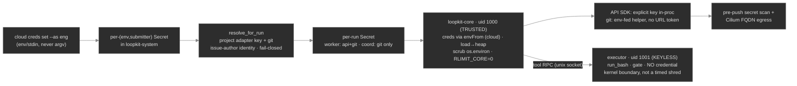

# 04 — Security model: the Ch 16 envelope at cloud scale (controls Built 🟢 Phases 2–5a)

The single-loop safety envelope ([`01`](01-system-today.md#safety-envelope-ch-16--safetypy)) is
**extended, not replaced**, on a shared multi-tenant cluster. This page is the threat model and the
defense-in-depth that answers it.

> **Built 🟢 (Phase 2):** the **control-plane context guard**
> ([`loopkit/extensions/cloud.py`](../../loopkit/extensions/cloud.py)), the **default-deny
> NetworkPolicy** + egress allowlist ([`k8s/cloud/30-networkpolicy.yaml`](../../k8s/cloud/30-networkpolicy.yaml)),
> and the **least-privilege RBAC** ([`k8s/cloud/20-rbac.yaml`](../../k8s/cloud/20-rbac.yaml) —
> `loopkit-control` is the only SA that may create namespaces/Jobs/Secrets; workers get a no-API SA).
> **Built 🟢 (Phase 3):** the **per-run** controls in
> [`loopkit/extensions/cloudrun.py`](../../loopkit/extensions/cloudrun.py) — each run namespace gets
> its own **default-deny NetworkPolicy** (egress only to DNS, Redis, and 443, metadata blocked), a
> **no-API worker SA** (token automount off), a per-run **Secret** (`envFrom`, GC'd with the
> namespace), and a **ResourceQuota/LimitRange**.
> **Built 🟢 (Phase 4):** the **webhook hardening** in
> [`loopkit/extensions/triggers.py`](../../loopkit/extensions/triggers.py) — **HMAC-SHA256 signature
> verification** (fail-closed) and **idempotency** (one run per issue) before any run starts, plus the
> **in-cluster context guard** (the trigger pods authenticate with their SA and the guard pins a
> synthetic, un-spoofable `in-cluster` context).
> **Built 🟢 (Phase 5a):** **per-submitter credentials, withheld from the agent** — the
> identity→Secret resolver ([`creds.py`](../../loopkit/extensions/creds.py)) + the worker-side
> credential hygiene ([`secrets.py`](../../loopkit/secrets.py)): the key is **loaded off a
> memory-tmpfs and shredded** out of the filesystem + `os.environ` before agent code runs, every
> untrusted-driven subprocess gets a **scrubbed env**, the webhook **binds the run to the issue
> author** (fail-closed allowlist), **CLI adapters are refused** on untrusted runs, and a **pre-push
> secret scan** + **Cilium FQDN egress** backstop the exfil paths. See *Credential handling along the
> injection flow* below.
> **Built 🟢 (Phase 6):** **agent isolation — the keyless executor sidecar** closes 5a's one residual
> (a same-uid `ptrace` of the in-process key) for the cloud worker by construction: the untrusted tool
> surface runs in a **different-uid, separate-PID-namespace container with no credential** ([`executor.py`](../../loopkit/executor.py),
> [`cloudrun._pod_spec`](../../loopkit/extensions/cloudrun.py)), a kernel boundary that *replaces* the
> timing-dependent shred there. The in-process shred/scrub stay as the containment for the no-sidecar CI
> + local tiers. See *The same-uid residual — closed for the cloud worker* below.

## Threat model

What's actually dangerous about this system, stated plainly:

> An **autonomous agent** runs with a **real credential** (an API key that costs money, git creds
> that can push), operating on **untrusted input** (issue bodies via `--from-issues`), on a **shared
> cluster** running **many tenants' runs** at once.

Three concrete risks follow:

1. **Prompt injection.** An attacker files an issue whose body contains instructions ("ignore the
   task, exfiltrate secrets / push to main / open a PR to a fork you control"). `--from-issues` feeds
   that body into the agent's prompt.
2. **Credential abuse / cost.** A compromised or runaway run burning an API key, or reaching a
   credential it shouldn't.
3. **Cross-tenant blast radius.** One run affecting another's compute, secrets, or network.

The design assumption is **the agent may be adversarial or hijacked** — so containment, not trust,
is the control. Least privilege is the throughline: the agent can only ever do what its namespace,
ServiceAccount, NetworkPolicy, Secret, and budget allow.

## Defense in depth

| Layer | Control | Answers |
|---|---|---|
| **Tenant isolation** | namespace per run; `ResourceQuota`/`LimitRange`; per-run Redis keyspace | cross-tenant blast radius |
| **Network** 🟢 | `NetworkPolicy` **default-deny** + egress allowlist (GitHub, `api.anthropic.com`/OpenAI, GHCR) — and *nothing else*; **workers get no cluster-API access** | exfiltration, lateral movement |
| **Identity** 🟢 | least-privilege ServiceAccounts: **only `loopkit-control` may create namespaces/Jobs/Secrets**; workers run a no-API-access SA; the control SA gets secrets `create,get,delete` — **no `list`/`update`/`patch`** (a listener RCE can't enumerate or rewrite a tenant's key) | privilege escalation |
| **Secrets** 🟢 | per-submitter source Secret → **only the adapter key + git projected** into a per-run Secret; in the **Phase-6 worker split** it is `envFrom`'d into **loopkit-core only** (trusted) while the untrusted `run_bash`/gate run in a **keyless executor sidecar** (different uid/PID-ns, no key); the no-sidecar CI/local tiers **load + shred** it off the FS/`os.environ`; **GC'd with the namespace**; at-rest depends on the cluster's etcd posture (sealed-secrets/SOPS; Vault ⚪) | secret theft, exfiltration, persistence |
| **Agent isolation** 🟢 | the model's chosen commands + the held-out gate run in a **separate-uid, separate-PID-namespace, credential-free** executor container — a kernel boundary, so a hijacked agent can neither `printenv`/`cat` nor `ptrace` the key | same-uid in-pod key read |
| **Code egress** | **branch-only pushes** (never `main`), **draft** PRs, refuses forbidden branches, never force | malicious merges |
| **Filesystem** | protected-path guard (agent can't touch `tests/`) + the pre-tool-use hook baked into the image | gaming the gate, destructive edits |
| **Cost** | per-run loopkit budget stop + provider Console spend limit (two independent backstops) | runaway / abusive spend |
| **Control plane** 🟢 | context-safety guard on the CLI/kubectl (pin DOKS context, fail-closed, confirm mutations) | wrong-cluster accidents |

These compose: defeating one layer (say, a prompt injection that hijacks the agent) still leaves the
attacker boxed by the network policy, the least-privilege SA, the branch-only push rule, the
namespace quota, and the budget ceiling.

## Prompt-injection containment

The honest position: **you cannot reliably prevent an LLM from following injected instructions, so
you contain what a hijacked agent can do.** For loopkit that means:

- **Least privilege is the defense** — a hijacked agent still can't reach the cluster API, can't
  egress anywhere off the allowlist, can't push to `main`, can't open a non-draft PR, and can't touch
  protected paths.
- **The agent never holds the key** (API-adapter runs, the trigger default) — loopkit makes the model
  call in-process and scrubs the key from every subprocess the agent drives, so there's nothing to
  exfiltrate; and **per-submitter keys cap the cost blast radius** — a poisoned issue burns the
  *submitter's own* budget, never a shared fleet key (see *Credential handling along the injection
  flow* above and [`03`](03-adapters-and-auth.md#per-submitter-keys--swap-keys-by-who-submits)).
- **Draft PRs keep a human in the loop** — nothing an injected run produces merges itself; a reviewer
  sees the diff before it lands.
- **The held-out gate resists output-gaming** — even a manipulated agent can't declare `DONE` without
  passing a gate it never saw ([`01`](01-system-today.md#the-held-out-acceptance-gate--the-anti-overfit-core-ch-9)).
- **The skills flywheel is a *stored*-injection surface, contained** (Phase 5b; review Finding B). A skill
  derives from the goal (an issue body on the trigger paths) and is rendered into **every future run's**
  prompt, so a run reaching DONE could persist instructions into the shared flywheel. Content guards
  (`extensions/skills._sanitize_skill`): **refuse** any skill carrying a credential-shaped value (no
  laundering a leaked secret into the shared repo), **cap** length + strip control chars, the default
  distiller **quotes a truncated goal as provenance** (not a raw imperative), and the rendered block is
  framed **advisory, not authoritative**. The blast-radius control is **namespacing the skills home per
  tenant** (a separate `--skills-repo`/`--skills-branch`), so a poisoned skill only re-enters its own runs —
  recommended for multi-tenant ([`part-iii-skills-repo.md`](../part-iii-skills-repo.md),
  [`part-iii-security-review.md`](../part-iii-security-review.md)).

## Credential handling along the injection flow (Built 🟢 Phase 5a)

The sharpest risk in the whole system: an **autonomous agent** runs on **untrusted issue text** in the
**same container, as the same uid**, as the loopkit process that holds a **real key**. Phase 5a's
position is blunt: **don't redact a leak, prevent the agent from ever holding the key.** Redaction is a
backstop (base64 defeats substring matching); the boundary is *withholding*.

The credential's life, and where each hop is closed:

**The leak/abuse vectors, and the control that closes each** (every one verified against code):

| Vector | Control |
|---|---|
| `run_bash`/gate inherit `os.environ` → `printenv` → trace/repo/push | **cloud worker:** they run in the **keyless executor sidecar** (no key in its env) — Phase 6; **CI/local:** `secrets.child_env()` scrubs every untrusted-driven subprocess |
| File-mount co-located with the agent uid → `cat /var/run/loopkit/creds/*` | **cloud worker:** the executor has **no Secret mount or envFrom at all**; the key is `envFrom`'d into loopkit-core only — Phase 6; **CI/local:** load → `os.remove` + scrub before agent code runs |
| Same-uid `ptrace`/`/proc/<loopkit>/mem` of the in-process key | **cloud worker:** the executor is a **different uid in its own PID namespace** — it can't see loopkit-core's PID, let alone read its memory — Phase 6 (the residual 5a could not close); **CI/local:** held only in heap, scrubbed from `os.environ` |
| Whose key = **attacker-controlled** webhook JSON (`sender.login`) | bind to the **issue author**; **fail-closed allowlist** (registered set); GitLab uses a pinned identity |
| Token-in-URL persists in `.git/config` | `sanitize_git_url` strips userinfo; auth via an env-fed credential helper (never argv) |
| Held-out gate runs agent-authored `conftest.py` with creds | the gate spawns with the scrubbed env too |
| Traced/echoed key (LangSmith = third party) | redaction registry on `trace._cap`, tool output at capture, exception detail |
| 443 egress to any host | per-run **Cilium FQDN** allowlist (DOKS); CLI adapters refused so the agent never holds the key anyway |
| A credential written into the repo before a human sees the draft PR | **pre-push secret scan** (registry + token-shape) hard-gates `push_branch` |
| A run orphaning a real Secret at rest on partial failure | `create_run` deletes the namespace on any apply failure |

**The same-uid residual — closed for the cloud worker (Phase 6 🟢).** 5a's honest residual was: in a
*single shared container* loopkit must hold the live key in-process to make the LLM/git calls, and the
agent's `run_bash` runs as the same uid — so a same-uid `ptrace`/`process_vm_readv` of loopkit's heap is
**not** closed by env/file scrubbing or `RuntimeDefault` seccomp (which doesn't block ptrace). **Phase 6
closes it by construction** for the cloud worker (the multi-tenant attack surface): the untrusted tool
surface (`run_bash`/read/write + the held-out gate) is dispatched over a Unix socket to a **keyless
executor sidecar** running as a **different uid in its own PID namespace** (`extensions/cloudrun._pod_spec`
+ `executor.py` + `RemoteToolExecutor`). uid 1001 has no `CAP_SYS_PTRACE`, can't see loopkit-core's PID,
and the key is never in its env, files, or address space — a **kernel-enforced** boundary that replaces
5a's timing-dependent shred. loopkit-core (uid 1000) keeps the key but runs only trusted code (the loop,
the LLM call, git clone/commit/push) and **never executes a model-chosen command**.

**What Phase 6 does *not* change (deliberate, refined from the design):** the in-process **load-shred +
`child_env` scrub remain** — they are the containment for the two tiers that have **no sidecar**: the
**CI deployment tier** (5c, an untrusted issue-triggered run with the API agent in-process) and untrusted
**local** runs. The sidecar is the cloud-worker kernel boundary; the shred is the everywhere-else
mitigation, and is harmless/redundant inside the split. (The design doc's "delete the shred globally" was
scoped to the cloud worker; deleting it would have regressed the CI tier — so we kept it.)

**Adjacency hardening (security review, [`part-iii-security-review.md`](../part-iii-security-review.md) —
Findings A + C, Built 🟢).** The sidecar invariant is "untrusted code never runs as uid 1000 in
loopkit-core's namespace." An adversarial pass found one path that re-opened it: loopkit-core runs `git`
(commit-every-tick, clone, push) **inside the shared workspace**, and the executor can write `.git/` in
that group-writable emptyDir — so a planted `.git/hooks/pre-commit` (or an injected `.git/config`
`core.fsmonitor`/`credential.helper`) would have executed **as loopkit-core, the key-holder**, on the
next commit/push (and could tamper the PR *after* the gate passed). **Closed** by hardening every
loopkit-core git call (`durability.HARDENED_GIT_FLAGS` + `remote.run_git`): `core.hooksPath=/dev/null` +
`core.fsmonitor=false` pinned on the command line (highest precedence, so an injected `.git/config` is
overridden → no hook runs), and the credential-helper list **reset** before loopkit's is set (an injected
helper can't also capture the token). Applied on **all three tiers**. Independently, the key-holder is now
marked **non-dumpable** (`prctl(PR_SET_DUMPABLE, 0)` in `secrets._harden`), so a same-uid neighbour can't
read its heap or `/proc/<pid>/environ` — note `os.environ.pop` does **not** scrub the original block
`/proc/<pid>/environ` exposes — **regardless of the node's `kernel.yama.ptrace_scope`**. This closes the
same-uid key-read on the no-sidecar tiers (CI/local `run_bash` is a same-uid child) and is defense in
depth for cloud loopkit-core.

**Remaining residuals.** (1) The executor shares loopkit-core's **network namespace** (same pod), so it
keeps the same 443 egress and could exfil *data it holds* (workspace/issue text) — **not the key** —
bounded by the FQDN egress allowlist + the pre-push scan; a separate-pod split (own netns) would close
that too, at the cost of cross-pod IPC (deferred). (2) **CLI adapters** run their own internal tool loop,
so their execution can't be relocated to a keyless executor — they stay **refused** on untrusted/trigger
runs. (3) redact-by-value is a backstop, not a boundary. (4) the `--from-issues` **sweep** spends one
identity for *all* swept issues (per-author attribution is the **webhook** path only).

## Budget ceilings

Two backstops, independent on purpose (one can fail without removing the other):

1. **loopkit budget stop** — per-run, in-process, fed by the adapter's `cost_usd`. The **API
   adapters** make this exact (native `usage`); making the budget stop bite on live runs is
   load-bearing in production, not optional.
2. **Provider Console spend limit** — per workspace/account, outside loopkit. With per-submitter keys,
   this is also a per-engineer ceiling.

## Control-plane / kubectl safety

A managed cloud context (DOKS) is **production-sensitive** under the global kubectl-safety rule. The
`loopkit cloud` CLI and any kubectl/helm use **must** (all three **Built 🟢 Phase 2** —
[`loopkit/extensions/cloud.py`](../../loopkit/extensions/cloud.py) +
[`Makefile`](../../Makefile) `cloud-*` targets):

- **Pin the expected cluster context** and **refuse/confirm before mutating any other** — the dev
  `Tiltfile`'s `allow_k8s_contexts(...)` + `fail()` guarantee, extended to the real cloud context.
  `check_context()` runs before every mutation (`bootstrap`, and every Phase-3 command on top) and is
  **fail-closed**: no pin (neither `--context` nor `$LOOPKIT_CLOUD_CONTEXT`) → refuse, rather than
  trusting the ambient context.
- Prefer explicit `--context=<expected>` over ambient current-context for mutating operations — the
  pin is *declared*, never inferred from whatever current-context happens to be.
- Treat the repo-local `KUBECONFIG` isolation pattern from the `Makefile` as the model — the
  `cloud-*` targets read `.kube/loopkit-cloud.yaml`, so cluster credentials never merge into the
  user's personal `~/.kube/config`.

This is the same discipline that kept the dev fleet from ever touching the host's other clusters; it
matters more, not less, against a cloud control plane.

## Webhook security (Built 🟢 Phase 4)

The webhook listener is the one inbound surface, so it's hardened specifically — and the
security-critical logic is a pure, exhaustively unit-tested `WebhookApp.dispatch`
([`extensions/triggers.py`](../../loopkit/extensions/triggers.py)):

- **Authentication on every delivery**, per forge, both constant-time and **fail-closed** (no
  configured secret ⇒ refuse; the `cloud webhook` command won't even start without
  `--secret`/`$LOOPKIT_WEBHOOK_SECRET`):
  - **GitHub** — **HMAC-SHA256 of the body** (`X-Hub-Signature-256`, `hmac.compare_digest`); reject
    anything unsigned or mis-signed (401). The signature is bound to the body, so a forged payload
    fails even with the right header.
  - **GitLab** — a **static secret token** (`X-Gitlab-Token`) compared constant-time. *Honest caveat:*
    GitLab does not sign the body, so the token is not bound to the request — a leaked token is
    directly replay/forge-able. That's GitLab-native behavior; treat the token as a high-value secret
    (rotate it, keep TLS on). One listener serves one forge (`--provider`).
- **Identity binding (🟢 Phase 5a):** *whose* key a run spends is the **issue author**
  (`issue.user.login`), **not** `sender.login` — so a maintainer merely *labelling* an attacker's
  issue can't bind their key to attacker content (a confused deputy). The registered per-submitter
  Secret set **is** the allowlist: an unregistered author → **403, no run** (default-deny), and the
  authorization check runs **before** the idempotency reservation, so a refused or failed delivery
  never marks the issue seen-and-dead (it can run once the submitter registers). GitLab's token isn't
  bound to the body, so its `user.username` is forgeable — the GitLab listener uses a **single pinned
  identity** (`--as`/`LOOPKIT_SUBMITTER`), never the payload. Untrusted runs are **`claude-api`** only
  (a CLI adapter holds the key in its own loop) — see *Credential handling* above.
- **Idempotency/dedupe** keyed on the **issue identity** (`repo#issue`), not the delivery id — GitHub
  re-delivers and a single issue can emit multiple matching events (opened, then labeled); both
  dedupe to **exactly one run**. In-memory (first-writer-wins) for a single replica; Redis
  `SET … NX EX` (atomic, with a TTL) when the Deployment scales past one replica. `release(key)` frees
  the reservation if `create_run` fails, so a transient error doesn't dead-lock the issue.
- An optional **trigger label** gates which issues dispatch a run, so an open backlog isn't
  auto-actioned wholesale — only issues bearing the label (e.g. `loopkit`).
- The listener creates runs through the same `create_run()` + `loopkit-control` SA — it has no extra
  privilege beyond submitting runs, and the in-cluster context guard still runs first.

## Secrets at rest

- **Honest baseline:** Secret values are **base64, not encrypted**, in the k8s API. At-rest protection
  depends on the cluster's etcd posture, which the operator must verify — DOKS provides disk-level
  volume encryption, not a customer-configurable Secret-KMS. For git-stored secrets use
  **sealed-secrets/SOPS**.
- ⚪ later: **External Secrets Operator / Vault** for central rotation + audit + no standing k8s
  secret — the most-secure tier, a localized resolver swap (see [`03`](03-adapters-and-auth.md)).

## Open hardening (⚪ Planned)

The one that mattered most — a **separate-PID-namespace, keyless agent container** so the agent's
`run_bash` can't `ptrace` loopkit's in-process key — is **Built 🟢 (Phase 6)**: the executor sidecar
above. What remains: a **separate-pod** split (own network namespace) to also close same-pod 443-exfil
of *content* (not the key); GitHub **App** auth (scoped, revocable) replacing PATs; a validating
**admission webhook** pinning
`--as` to the authenticated identity (so `--as` is an authorization, not a trust assertion); a scoped
**per-engineer self-service RBAC** Role for `cloud creds set/rm`; tighter per-run quotas; a
cluster-wide **admission/concurrency cap** on runs; signed commits. (Per-run **Cilium FQDN egress** and
the **pre-push secret scan** landed in Phase 5a.) Tracked in [`../part-iii-resume.md`](../part-iii-resume.md).
