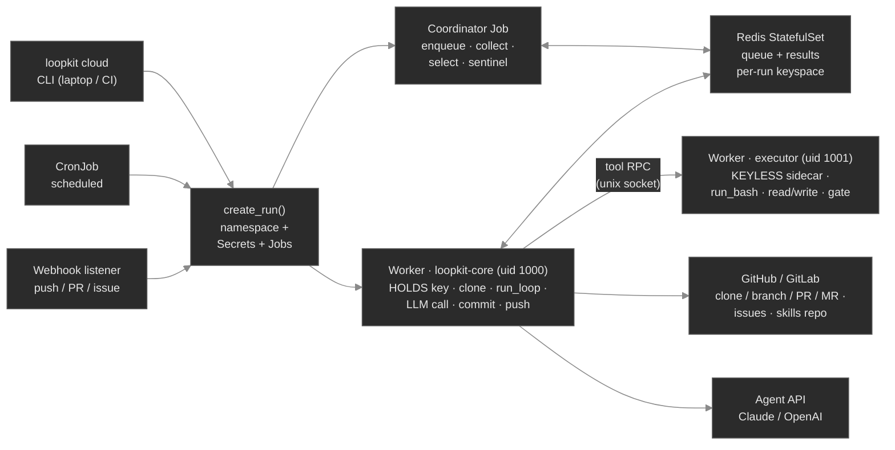

# loopkit Architecture

The living architecture reference for loopkit — written for principal-level engineering use:
decisions with their rationale and trade-offs, not just description. This is the canonical map of
how the system is built and where it is going, for humans and for AI agents working on the project.

> **Companion docs.** This wiki describes *how things are/will be*. For *where we are and what's
> next*, read [`../part-iii-resume.md`](../part-iii-resume.md) (current phase) first. The project
> instructions and the documentation contract live in [`../../CLAUDE.md`](../../CLAUDE.md).

## Maintenance contract

These docs are load-bearing. **Update them in the same change that alters the system** — a new
module/subsystem, a changed contract, a locked (or reversed) decision, a new failure mode, a new
control/data-flow path. Keep the page that *owns* the area current and keep the master diagram below
in sync with the topology. History goes in `git log`, not here (nor in the resume doc). See
[`CLAUDE.md`](../../CLAUDE.md) → *Documentation contract* for the full rule.

## Page map

| Page | Owns |
|---|---|
| **README** (this page) | The map, the master diagram, the glossary, the status legend |
| [`01-system-today.md`](01-system-today.md) | **Built:** the single-loop core, its contracts, the **2×2 adapter matrix** + cost (`pricing.py`), the **two-layer observability** (logs + LangSmith traces), the extension seams, the in-process + dev-cluster fleet |
| [`02-cloud-architecture.md`](02-cloud-architecture.md) | **Designed:** the Part III Kubernetes/DOKS target — topology, run lifecycle, control plane, storage, scaling, triggers. **Built 🟢 (Phase 1):** image & registry (`worker-image` → GHCR). **Built 🟢 (Phase 2):** control-plane foundation — context guard + `loopkit cloud`, `ns/loopkit-system` manifests (Redis AOF+PVC, RBAC, NetworkPolicy). **Built 🟢 (Phase 3):** run mechanics — sentinel shutdown + `cloudrun.create_run` (per-run ns + coordinator/worker Jobs) + `cloud run/ls/status/logs/kill`. **Built 🟢 (Phase 4):** triggers — in-cluster auth + CronJob (`cloud schedule`) + GitHub/GitLab webhook listener (HMAC or token + idempotency → `create_run`) |
| [`03-adapters-and-auth.md`](03-adapters-and-auth.md) | The agent-adapter matrix (CLI/API × Claude/OpenAI), the pluggable credential model, per-submitter keys, billing |
| [`04-security.md`](04-security.md) | The Ch 16 safety envelope at cloud scale — threat model and defense-in-depth. **Built 🟢 (Phase 2):** context guard, default-deny NetworkPolicy, least-priv RBAC. **Built 🟢 (Phase 4):** webhook HMAC + idempotency, in-cluster context guard. **Built 🟢 (Phase 5a):** per-submitter creds withheld from the agent. **Built 🟢 (Phase 6):** agent isolation — the keyless executor sidecar closes the same-uid in-pod key-read residual |

For the **teaching** view of Part III — the GitHub/GitLab ecosystem, the three tiers as a *lesson*, and
the two runnable labs (`loopkit demo 20` triggers, `demo 21` the CI tier) — see
[`../part-iii-ecosystem.md`](../part-iii-ecosystem.md). This wiki describes how the system *is built*;
that module teaches *how to use it on a real repo*.

**Cross-cutting companion docs:** [`../part-iii-security-review.md`](../part-iii-security-review.md)
(the adversarial full-flow review — the sidecar git-hook adjacency, flywheel poisoning, the non-dumpable
key-holder, and the tracked follow-ups) and [`../part-iii-prior-art.md`](../part-iii-prior-art.md)
(the canonical harnesses mapped to loopkit's design — what validates its bets, the ACI / two-oracle /
`pass^k` lessons it adopted or should, and where the field is heading).

For **Part IV — molding loopkit to a repo** (the copilot molds *with* a verified kit, not a monolith):
[`../part-iv-molding-kit.md`](../part-iv-molding-kit.md) (design) · [`../part-iv-resume.md`](../part-iv-resume.md)
(resume). Layers 1–2 built: the `loopkit-mold` skill (`examples/molding/`) and `loopkit synth-gate` —
fail-first oracle verification (`extensions/synth_gate.py`, described under *Oracle synthesis* in
[`01-system-today.md`](01-system-today.md)).

## Deployment tiers

loopkit runs at three escalating tiers — pick the smallest that fits; each reuses the same single-loop
core, only the *trigger / secrets / isolation* differ:

| Tier | Runs | Trigger · secrets · isolation | For | Status |
|---|---|---|---|---|
| **Local** | `loopkit run` on a laptop | a human · local env · the laptop | iterating by hand | 🟢 Built |
| **CI** | `loopkit run` in a CI job | forge issue/cron/manual · **CI-native** secrets · the **ephemeral runner** | hands-off issue→PR, no cluster | 🟢 Built (Phase 5c — `run --from-event/--from-issue/--open-pr`, `init --ci`; see [`../part-iii-ci-mode.md`](../part-iii-ci-mode.md)) |
| **Cloud fleet** | coordinator + worker Jobs on DOKS | CLI/CronJob/webhook · per-submitter resolver + **keyless executor sidecar** · namespace + **two-container** split | concurrent/`evolve`/multi-tenant | 🟢 code-built (Phases 2–6), live-pending |

The credential machinery (resolver, shred, **keyless-executor sidecar**) is **cloud-tier only** — the CI
tier delegates secrets/identity/sandbox to the forge, which is its whole appeal. The cloud tier's
agent-isolation split (the keyless executor that closes the same-uid in-pod key read) is **built** —
see [`../part-iii-agent-isolation.md`](../part-iii-agent-isolation.md).

## Status legend

Every claim in these docs carries one of these, so a reader always knows what exists vs. what is
targeted:

- **🟢 Built** — implemented, tested, in `main`. (Core, Part II extensions, dev kind/Tilt fleet.)
- **🟡 Designed** — decided and specified here, not yet built. (The Part III cloud system.)
- **⚪ Planned** — a known future direction, not yet specified. (Operator/CRD, KEDA, Vault, dashboard.)

## Master diagram — the Part III target topology 🟡

> Render with `/render-mermaid --hd` to verify (dark-greyscale, flat by house style). **Namespaces:**
> `ns/loopkit-system` holds the long-lived Redis StatefulSet + webhook listener; each run gets an
> ephemeral `ns/run-<id>` holding its coordinator Job, worker Job, and Secrets, GC'd on completion.
> The three submit paths (CLI, CronJob, webhook) **converge on one `create_run()`** — the single
> code path that materializes a run. Full detail in [`02-cloud-architecture.md`](02-cloud-architecture.md).

## Glossary

| Term | Meaning |
|---|---|
| **Tick** | One iteration of the core loop: `prompt → agent → guard → commit → review → gates → stops`. |
| **Gate** | An external command whose exit status verifies work. Two kinds: the **iteration gate** (the agent can see/run it) and the **held-out acceptance gate** (the agent cannot — the anti-overfit check). |
| **Hard stop** | A terminal condition independent of the goal: budget, no-progress, iteration cap. Precedence: `DONE > SAFETY > BUDGET > NO_PROGRESS > CAP`. |
| **Run** | One logical unit of work: a target repo + a goal (or a set of tasks) + a budget, producing branches/PRs. The cloud siloing/accounting unit (one `ns/run-<id>`). |
| **Task** | One item within a run (one goal, one branch). Workers pull tasks off the queue. |
| **Fleet** | Many workers draining a queue in parallel. In-process (`Supervisor`), or queue-driven across containers (`Coordinator`/`Worker` over Redis). |
| **Coordinator** | Transport-only driver: enqueues tasks, collects outcomes, runs evolutionary selection. Holds no agent and no gate. |
| **Worker** | The executor: `pop → clone → run_loop → push → put outcome`. Physical isolation = its own pod filesystem + branch. |
| **Adapter** | A concrete `Agent` implementation. Four real ones (the 2×2 matrix): `claude-code` / `codex` (CLI) and `claude-api` / `openai-api` (SDK), plus the token-free `mock`. See [`03`](03-adapters-and-auth.md). |
| **Cost / pricing** | The per-tick dollar cost an adapter reports, computed by `pricing.py` from native token usage (per-model table, cache tiers). Feeds the budget stop and every trace span; unpriced model → 0.0 (the budget can't bite — `doctor` warns). |
| **Trace** | An optional full LangSmith run tree (`run → tick → agent → llm/tool → gate`) carrying human-readable I/O, all tool calls, and cost/usage metadata. The always-on, payload-free `[loopkit][component]` logs are its complement — see [`01`](01-system-today.md#observability--two-layers-logs--traces). |
| **Held-out / selection-inflation guard** | A candidate may only "win" (reseed a generation, be declared done) after passing a gate it never competed on — the Ch 9 defense against overfitting/reward-hacking. |
| **Control files** | Per-repo steering that travels with the clone: `loopkit.toml`, `PROMPT.md`, `CLAUDE.md`/`AGENTS.md`, the gate commands, skills `.md`. See [`../CONTROL-FILES.md`](../CONTROL-FILES.md). |
