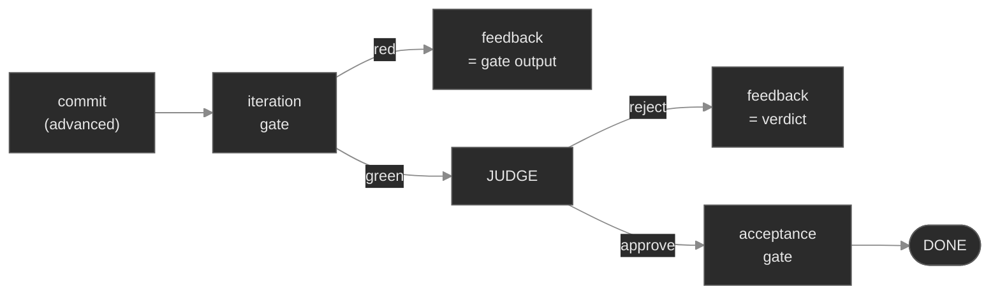

# Built-in default judge — design & build plan

**Status:** design locked (v3 — end-to-end flow vetting complete), not yet built. The observability groundwork shipped in PRs #17 + #18:
`ReviewConfig.decide()` returns a `ReviewDecision(command, reason)` and there is a
`TODO(default-judge)` branch at [`config.py:164`](../loopkit/config.py) where this feature plugs in.
Read this doc cold and build it.

## Why

Review should be **on by default, off only when expressly disabled** — so a quality gate is never
silently skipped (the failure mode that let review fire in zero of 28 batch runs). PR #17 shipped
*half* of that: review is opt-out **when configured**. Verified at `HEAD` (f9f5e17):

```
bare default  [review] unset     -> on=False  reason=no [review] command configured (built-in judge not yet wired)
command set                      -> on=True   reason=[review] command
command set + --no-review        -> on=False  reason=--no-review
bare + explicit --review         -> on=True   reason=explicit override (--review / manifest review=)
enabled=false                    -> on=False  reason=disabled ([review] enabled = false)
```

Row 1 is the gap: a project that never wrote a `[review] command` gets **no review at all**. PR #18
made that state announce itself loudly instead of hiding, which is why it *feels* fixed — but
"on by default" only means something if there is *something to run* when nothing is configured. That
something is the **built-in default judge**: a generic adversarial reviewer that runs out of the box,
is enrichable, and is fully overridable.

Prior art is already in-repo: [`examples/gates/review.sh`](../examples/gates/review.sh) is a working
judge (rubric + diff + verdict, fail-closed four ways). This feature **promotes that bash example to
a first-class primitive** — because an example can never be a default.

### Why this isn't "just an LLM call in code"

`part-iv-resume.md` carries a binding invariant: *"If a layer is just an LLM call, it belongs in the
skill, not in code."* The judge is an explicit, reasoned carve-out:

- It is **verification, not generation**. The molding-kit rule exists to stop loopkit shipping "an LLM
  writes your config." A judge produces no artifact — it renders a verdict on one.
- **A skill cannot be a default.** Skills are human-invoked; the loop runs unattended. Default-on is
  the entire point, and only code can supply it.
- The **code half is not the prompt**. It is the fail-closed contract, nonce verdict parsing, cost
  accounting, timeout, process isolation, backend derivation, and the stall stop — none of which a
  skill can provide. Judgment itself stays *data* (bundled prompt text + rubric files). That is the seam.

## Locked design decisions

| Fork | Decision | Rationale |
|---|---|---|
| **Timing** | Runs **after a green iteration gate**, not before it | No tokens on a draft that doesn't pass its own tests; honors the doctrine written in `review.sh:23-27`. Changes Ch 8 ordering — see [Loop reordering](#loop-reordering) |
| **Verdict stickiness** | Verdicts are **cached per HEAD sha** — a REJECTed HEAD stays rejected (free, no re-call) until HEAD changes; an APPROVEd HEAD never re-bills | Closes the **reject-then-idle hole** that exists today: `review_ok` resets to `True` each tick and review fires only when `advanced` (`loop.py:305-306`), so a rejected commit followed by an idle tick sails through the gates to DONE (`loop.py:326-362`) before NoProgress (`:390`) can catch it |
| **Plan mode** | **Per-item delta + full final review** — each green tick judges only that item's delta (`last_judged…HEAD`); when the checklist completes, one full `base…HEAD` review certifies before acceptance | Per-item feedback while the producing context is fresh, without the ~N²/2 cost of re-judging the cumulative diff on every item of a backlog |
| **Oversized diff** | **Fail-closed truncation** — full `git diff --stat` always included; patch body capped (~150k chars); when truncated the judge is instructed to REJECT, naming the unseen files, if it cannot certify every criterion from what is visible | Burying bad code past the cap yields a REJECT, not an unreviewed APPROVE — hidden = unreviewable = rejected |
| **Stall stop** | `REVIEW_STALL` = **N consecutive REJECTs, any wording** (`stops.review_stall_after`, default 4); any APPROVE resets; gate-red ticks don't count (the judge didn't run) | Deterministic and immune to verdict-text variance — "unchanged verdict" almost never string-matches across LLM calls |
| **CLI verb** | Ship **`loopkit review`** in the first cut — exit 0 APPROVE / 1 REJECT / 2 unavailable | One impl, two entry points (`DefaultReviewHook` + the subcommand both call `run_judge`); ad-hoc judging, shell-debuggability, and an explicit-command wiring option for mold |
| **Backend** | Derives from `[agent].adapter`; `[review] backend` overrides. **All five adapters defined**, incl. API + mock | No adapter has an undefined judge; `mock` must never spawn a subprocess |
| **Model** | Derives from `[agent].model` ("the current session"); `[review] model` overrides | One line buys a cheaper judge, a stricter judge, or a different model entirely |
| **Infra failure** | **Halts** the run with `StopReason.REVIEW_UNAVAILABLE` — distinct from a REJECT verdict | A missing binary is not a defect. Fail-closed-as-REJECT burns the whole iteration cap telling the agent to fix a phantom bug |
| **Unpriced judge model** | **Warn at preflight, run anyway** | Consistent with today's agent-side `known_model()` treatment; never blocks a run over an accounting gap |
| **Verdict** | **Real defects only** — correctness, security, incomplete fix, gaming, trivially-passing tests, contract breaks. Style is advisory, never blocking | A judge that blocks on nits gets disabled, and then it protects nothing |
| **Anti-spoof** | Per-run **nonce** in the verdict grammar; instruction placed *after* the diff | The diff is agent-authored, untrusted input to the judge prompt |
| **Isolation** | Judge subprocess runs with `cwd=` a scratch dir, never the repo | Read-only becomes structural, not flag-dependent |
| **Mold** | **Layered** — bundled criteria + project criteria + per-task rubric | Plain `run` still gets the generic judge; batch/mold users get task-specific teeth |

Independence-by-default comes from a **fresh, clean-context, adversarial, read-only** pass (no shared
memory with the coder), *not* from a different model — so it works with one backend, and true
cross-model diversity is one override away.

## Config surface

```toml
[review]
enabled     = true      # master switch; false = review off everywhere
command     = ""        # custom judge shell command; unset = the built-in judge
backend     = ""        # unset = inherit [agent].adapter
model       = ""        # unset = inherit [agent].model  ("the current session")
args        = []        # extra flags for a CLI judge backend
use_api_key = false     # unset = inherit [agent].use_api_key (claude-code billing)
criteria    = []        # project rubric file(s), layered onto the bundled checklist
```

`enabled` and `command` already exist; the rest are new.

### Backend derivation — every adapter defined

| `[agent].adapter` | judge backend | invocation | cost |
|---|---|---|---|
| `claude-code` | `claude` CLI | `claude -p <prompt> [--model M]` | scraped `total_cost_usd` |
| `codex` | `codex` CLI | `codex -p <prompt> [--model M]` | `estimate_cost(model, usage)` |
| `claude-api` | Anthropic SDK | `_Backend.complete(transcript, [])` | **exact** — `turn.usage` |
| `openai-api` | OpenAI SDK | `_Backend.complete(transcript, [])` | **exact** — `turn.usage` |
| `mock` | `MockJudge` | none — auto-APPROVE | 0.0 |

**`mock` is load-bearing, not a stub.** `AgentConfig.adapter` defaults to `"mock"`
([`config.py:21`](../loopkit/config.py)), so the zero-config case — and every `loopkit demo`,
scenario, and test — derives its judge from `mock`. Combined with default-on review and the
halt-on-infra-failure rule, a naive derivation would try to spawn `claude`, fail, and halt the entire
teaching surface with `REVIEW_UNAVAILABLE`. `MockJudge` keeps demos and the suite token-free, which is
a stated repo invariant.

**API backends are the *simpler* path, not the harder one.** `_Backend.complete(transcript, tools)`
([`agent.py:470`](../loopkit/agent.py)) with `tools=[]` is a single-shot completion that returns
`turn.usage` — exact cost, no scraping — and the backend is already injectable
(`ClaudeAPIAdapter(backend=...)`), which is the same fake seam `tests/test_adapters.py:252-262` uses.

### The three recipes this unlocks

```toml
# 1. cheap judge — code with opus, judge with haiku (same adapter, different model)
[review]
model = "claude-haiku-4-5"

# 2. strict judge — code with sonnet, judge with opus
[review]
model = "claude-opus-4-8"

# 3. cross-model blind-spot diversity — code with Claude, judge with Codex
[review]
backend = "codex"
model   = "gpt-4.1"
```

Recipe 3 is the strongest quality argument for the feature: an independent *model* catches failure
modes that a fresh-context pass of the *same* model is systematically blind to. It also has a nice
security property — the judge holds a credential (`OPENAI_API_KEY`) the coding agent never sees.

**Credentials follow the backend, not the agent.** The judge call scrubs env via
`secrets.current().child_env(add=<judge backend cred keys>)`. Cross-backend judging means a
*different* key is un-scrubbed for the judge subprocess than for the agent — deliberate, and doctor
must probe both (see [Doctor & preflight](#doctor--preflight)).

## Architecture

New module `loopkit/extensions/judge.py`:

```
DEFAULT_REVIEW_CRITERIA: str              # the bundled generic adversarial checklist
JudgeVerdict(passed, reason, raw, cost_usd)
JudgeUnavailable(Exception)               # infra failure — NOT a verdict

resolve_judge(review_cfg, agent_cfg) -> JudgeTarget(backend, model, args, use_api_key)
build_judge_prompt(goal, commit_message, diff, stat, extra_criteria, nonce) -> str
run_judge(workspace, *, target, base, goal, commit_message,
          extra_criteria=(), runner=None) -> JudgeVerdict
    # 1. stat = git diff --stat base...HEAD (always full); diff = the patch, capped fail-closed
    #    (fall back to HEAD~1..HEAD when base is unresolvable); empty ⇒ APPROVE by vacuity
    # 2. nonce = per-call token; prompt = goal + commit msg + criteria + stat + diff +
    #    verdict instruction (instruction LAST — after all agent-authored content)
    # 3. out = (runner or _dispatch)(prompt, target)   — runner injectable for tests
    # 4. return _parse_verdict(out, nonce)             — no nonce'd verdict ⇒ JudgeUnavailable

class DefaultReviewHook(ReviewHook):      # review(workspace, commit_message) -> GateResult
```

**The prompt must carry the goal.** Three of the six BLOCK criteria — incomplete fix, gaming, and
"contract break *the goal didn't ask for*" — are unjudgeable without knowing what the task *was*. The
hook receives `config.goal` at construction and `commit_message` per call; both go into the prompt
ahead of the criteria. (The v1/v2 prompt was criteria + diff only — a judge flying blind on scope.)

**Base-ref resolution.** No fork point is recorded anywhere: `durability.ensure_branch`
(`durability.py:87-99`) creates the run branch from HEAD *or resumes an existing local/remote branch*
(the revise path), so `base…HEAD` has no defined `base`. Resolution chain:

1. Capture `HEAD` at **hook construction** (both call sites build the hook before `run_loop` calls
   `ensure_branch`, so this is the fork point for fresh runs and batch scratch clones alike);
2. at review time use `git merge-base HEAD <captured>` (correct even when resuming a branch whose
   origin has advanced);
3. fall back to `HEAD~1..HEAD` when neither resolves.

**Verdict cache (sticky per HEAD).** The hook keeps `{head_sha: JudgeVerdict}`. The judge is invoked
only when the iteration gate is green AND the current HEAD is unjudged; a cached REJECT keeps
`review_ok=False` on idle ticks **without a model call**, and a cached APPROVE never re-bills. This
replaces the `advanced` condition — "only judge new work" falls out of the cache key — and closes the
reject-then-idle hole named in the decisions table. In plan mode the cache key doubles as
`last_judged` for the per-item delta range.

`JudgeVerdict` collapses to `GateResult(passed, feedback)` at the hook boundary — `GateResult`
([`gate.py:20-23`](../loopkit/gate.py)) has only two fields, so `raw` and `cost_usd` ride the trace
span and the loop's cost accumulator instead.

### Verdict grammar — one spelling, nonce'd

The repo currently has **three** spellings: `ACCEPT` (`review.sh`), `APPROVE` (this doc's v1), and
"REJECT if" (the mold rubric template). Canonicalize on **emit `APPROVE`, accept both on parse**.

The diff is agent-authored content embedded in the judge prompt, and the parse rule is "last verdict
line wins" — so a diff containing that string steals the verdict. Two cheap defenses:

1. A per-call **nonce**: the judge is instructed to end with exactly
   `VERDICT[<nonce>]: APPROVE` or `VERDICT[<nonce>]: REJECT — <reason citing file:line>`.
   The nonce is generated per call and cannot appear in a diff written before it existed.
2. The **verdict instruction comes after the diff**, so the last thing in the judge's context is the
   contract, not attacker-controlled text.

A response with **no correctly-nonce'd verdict** raises `JudgeUnavailable` (the judge did not
actually render a decision) rather than silently becoming a REJECT.

### `DEFAULT_REVIEW_CRITERIA`

Product-agnostic, real-defects-only. **BLOCK** on:

- **Correctness** — a bug on a reachable input.
- **Security** — authz gap, injection, committed secret, sensitive data logged, forgeable trust boundary.
- **Incomplete fix** — a sibling instance of the same bug left unfixed (name it).
- **Gaming** — deleted/weakened/skipped test, loosened assertion, gate or CI edit, test-input special-casing.
- **Trivially-passing test** — one that passes against the OLD buggy code.
- **Contract break** — a renamed/removed field or changed status/signature the goal didn't ask for.

Do **not** block on formatting, naming, or structure — note them as advisory. The rule exists because
a judge that blocks on nits gets turned off, and a turned-off judge protects nothing.

## Loop reordering

Today `loop.py` runs review at `:306`, **before** the iteration gate at `:327`, and a REJECT skips
every gate. The locked decision moves the judge behind a green iteration gate:



Why: `review.sh:23-27` already argues it in the repo's own words — an LLM judge is nondeterministic
and costs tokens, so gating it behind the free mechanical check means no review is ever spent on a
draft that isn't structurally done. Ch 8's claim softens from "review every commit" to "review every
plausibly-done commit," which is the honest description of what a *default* judge should do.

**Plan mode** (`loop.py:335-336, 376-384` — green gate + open items skips acceptance and continues):
each green tick judges the **item delta** (`last_judged…HEAD`); when `plan_blocks` clears, one
**full** `base…HEAD` review certifies before acceptance. Per-item feedback stays fresh; the final
pass still sees the whole change; cost stays linear in backlog length.

**Feedback discipline:** the verdict `reason` is capped (~4k chars) before it rides `build_prompt`
(`prompt.py:54-58` embeds feedback verbatim; `ShellReviewHook` already tails at 2000) — the full raw
transcript belongs to the trace span. **Advisory notes** (style/naming — never blocking) go to the
trace span outputs only; they are *not* fed back, so the loop never churns on nits.

**Follow-on edits:** the `ch08_review.py` scenario, the Ch 8 prose in `README.md:150-152`, and
`tests/test_review.py` (which pins the current ordering).

## Cost, stops, and timeouts

**Judge spend is currently invisible.** `loop.py:264` accumulates only `result.cost_usd` from the
agent, and `LoopState` is constructed at `loop.py:296` — *before* review runs at `:306`. So even
summing judge cost in wouldn't reach `BudgetCeiling` until the following tick. Required changes:

1. `run_judge` returns `cost_usd`; the loop adds it to `cost`.
2. Build `LoopState` **after** review so the budget stop sees the tick's true spend.
3. Preflight warns when the judge model isn't in `PRICES` — `estimate_cost` returns `0.0` for unknown
   models (`pricing.py:103-111`) and `DEFAULT_MODELS` has no `claude-code`/`codex` entry, so a CLI
   judge with no `[review] model` prices at zero and the budget stop cannot bite.

**No timeout exists today.** Neither `_CLIAdapter` (`agent.py:133`) nor `ShellReviewHook`
(`review.py:62`) passes `timeout=`. The only correct precedent in the repo is `mold.ShellProposer`
(`mold.py:241,254-257`). A default-on judge without a timeout is a new hang surface on every run —
follow the `ShellProposer` pattern; a timeout raises `JudgeUnavailable`.

**Two new stops.** Both follow the `NoProgress`/`PlanStall` template in `stops.py`:

| Stop | Fires when | Why |
|---|---|---|
| `REVIEW_UNAVAILABLE` | `JudgeUnavailable` — missing binary, auth failure, timeout, no nonce'd verdict | Terminal, run not DONE. Never burns the cap chasing a phantom defect |
| `REVIEW_STALL` | **N consecutive REJECTs, any wording** — `stops.review_stall_after`, default 4. Any APPROVE resets; gate-red ticks don't count (the judge didn't run) | Bounds the money pit `tests/test_review.py:57-66` already documents — at 2 model calls per tick. Counting rejections (not "unchanged verdicts") is deterministic and immune to LLM text variance |

Note the interaction that makes `REVIEW_STALL` necessary rather than nice-to-have: during a reject
loop the agent edits code each tick, so the git signature keeps changing and `NoProgress` **never
fires** — without this stop the only bound is the total budget.

`REVIEW_UNAVAILABLE` preserves the safety property (unreviewed work still can't be DONE) *without*
the cost of pretending a broken judge is a code defect.

## Integrity

| Surface | Guard |
|---|---|
| Judge can edit the workspace | Run the subprocess with `cwd=` a scratch dir. The diff is in the prompt, so the judge needs no filesystem access at all — read-only becomes structural rather than dependent on backend flags that may drift |
| Verdict spoofing via the diff | Per-call nonce + instruction-after-diff (above) |
| Agent tunes its own grader | `[review] criteria` files are repo paths the agent can edit. Add a **preflight warning** mirroring `safety.py:73-75` (which already warns when an acceptance gate has no `protected_paths`) when criteria files aren't protected |
| Judge output leaking secrets | Already handled — `loop.py:313` runs `secrets.redact` before the verdict becomes feedback |

## Call-site wiring

`ReviewDecision` grows `kind: "off" | "command" | "default"`. Two hazards:

1. **`on` must be redefined.** `config.py:126-128` defines `on = command is not None`. A `default`
   decision has `command=None`, so all four render sites (`local.py:130`, `local.py:423-424`,
   `batch.py:459`, `batch.py:463`) would print **off while the judge runs** — precisely the bug class
   this feature exists to kill. Make it `on = kind != "off"`.
2. **`batch.py:462` constructs `ReviewDecision` positionally** — `kind` needs a default or that line
   must move to keyword form.

`decide()` — replace the `TODO(default-judge)` branch, keeping today's precedence:

```
if disabled:             off,     "--no-review"
if override is not None: command, override
if not enabled:          off,     "disabled (enabled=false)"
if command is not None:  command, "[review] command"
else:                    default, "built-in judge (<backend>/<model>)"
```

Hook construction at both call sites:

```
if decision.kind == "command":   hook = ShellReviewHook(decision.command)
elif decision.kind == "default": hook = DefaultReviewHook(cfg.review, cfg.agent)
else:                            hook = None
```

Both sites have the full `cfg`. **Batch's base-config fallback** (`batch.py:459-462`) becomes dead
once `default` exists — every task resolves on — so remove it rather than leave a misleading branch.

## Deployment surfaces (batch · cloud)

- **Cloud worker image ships only `claude`** (`Dockerfile:28` — `npm install -g
  @anthropic-ai/claude-code`). A `[review] backend = "codex"` judge in the fleet hits
  `REVIEW_UNAVAILABLE` on every run until the image adds the codex CLI; cross-backend judging also
  requires the judge's credential (`OPENAI_API_KEY`) in the worker's per-run Secret / in-heap store —
  `child_env(add=…)` resolves store-first, so the store must actually hold it. Preflight's binary
  probe catches this at run start rather than mid-run.
- **Batch concurrency**: `run_batch` defaults to `jobs=3` (`batch.py:306`), so a batch can hold 3
  concurrent judge calls *on top of* 3 agent calls — subscription/API rate-limit pressure doubles.
  Not a blocker; doctor's cost note should mention it, and `--jobs` is the existing relief valve.
- **Evolve/orchestration** (Ch 10-11): each candidate loop carries its own judge; judge cost lands in
  each run's `cost` (below), so per-candidate budgets stay honest.

## Doctor & preflight

- **Doctor review row** (`local.py:127-135`): when `kind == default`, show
  `on — built-in judge (<backend>/<model>)`.
- **Probe the *judge* binary, not the agent's.** `_doctor_agent` (`local.py:174-198`) probes
  `_CLI_BINARIES[cfg.agent.adapter]`; with a `[review] backend` override that's the wrong binary and
  a different credential. Add a judge row using the same `shutil.which` + `_claude_code_auth_note`
  pattern.
- **Preflight** (not just doctor) probes the judge backend, so an unavailable judge is caught before
  the run spends anything. With the gate-first ordering, an unprobed judge would otherwise surface
  only at the first plausibly-done tick.
- Doctor notes **"review runs a model call per plausibly-done tick"** so on-by-default is never a
  silent spend.

## Observability

- The `review` span (`loop.py:307`) currently carries no `inputs`/`metadata`. Add
  `metadata(kind=, backend=, model=)`.
- A judge `llm` span **nests automatically** under it via LangSmith contextvars — no tracer threading
  — giving per-review cost visibility for free. Follow the `agent.py:522-533` pattern
  (`run_type="llm"`, `metadata(cost_usd=…)`).
- Logs stay payload-free: `gate.review` + `gate.review.rejected` already log the verdict reason,
  single-lined and tail-trimmed (`loop.py:319-320`).

## Mold layering (Phase 2)

- Mold generates a per-task **rubric** at `<out_dir>/<task_id>/rubric.md` — the natural sibling of
  `GOAL.md` (`mold.py:364`) and `acceptance/` (`mold.py:358`).
- Generation rides the injected `ShellProposer` seam via a new `MOLD_RUBRIC_FILE` env var, mirroring
  the optional-byproduct pattern already used for `MOLD_TOUCHES_FILE` (`mold.py:231-234`, read back
  at `:372-375`). Mechanical code never fakes judgment — that stays the proposer's job.
- Wire it through `_render_task_config` (`mold.py:428-474`) as a `[review] criteria = [...]` section,
  **not** through the manifest: the per-task `loopkit.toml` already travels as the reviewable unit and
  `make_batch_runner` loads it (`batch.py:427`) and reads `cfg.review` (`batch.py:458`).
- Add a `{rubric_file}` placeholder to `_fill_placeholders` (`mold.py:556-566`) for custom commands.
- Result: bundled generic criteria + project criteria + per-task rubric, composed.

## `loopkit review` subcommand (first cut — decided)

```
loopkit review [--backend B] [--model M] [--criteria F ...] [--base REF] [--goal-file F]
# exit 0 = APPROVE · 1 = REJECT (verdict on stderr-visible output) · 2 = unavailable
```

One implementation, two entry points: the subcommand and `DefaultReviewHook` both call `run_judge`.
This buys ad-hoc judging of any diff, shell-debuggability (reproducing a judge decision = running a
command, not a whole loop), and an explicit-command wiring option for mold. Exit code 2 keeps the
infra-failure/verdict distinction visible to shell callers, mirroring `REVIEW_UNAVAILABLE`.
`tests/test_cli_surface.py` is an **exact-equality snapshot** — `EXPECTED` must gain the new command
(and any new flags) in the same commit.

## Testing (same commit)

- **No real CLI/API calls** — inject `runner=` into `run_judge`; use the `FakeBackend` pattern
  (`tests/test_adapters.py:252-262`) for API targets and `_proc(...)` (`:73-74`) for CLI parsing.
- `_parse_verdict`: APPROVE / REJECT / **wrong-nonce verdict ignored** / no verdict ⇒ `JudgeUnavailable`
  / multiple verdicts (last correctly-nonce'd wins) / a diff containing a forged `VERDICT:` line.
- `build_judge_prompt`: goal + commit message + criteria + full `--stat` + capped diff, instruction
  last; empty diff ⇒ APPROVE by vacuity; over-cap diff carries the fail-closed truncation instruction.
- **Verdict cache**: REJECTed HEAD + idle tick ⇒ `review_ok` stays False with **zero** judge calls
  (the reject-then-idle regression test); APPROVEd HEAD never re-judged; new HEAD ⇒ fresh call.
- **Base resolution**: fresh run (construction-HEAD = fork point), resume-branch (merge-base wins),
  detached/first-commit fallback to `HEAD~1`.
- **Plan mode**: item ticks judge the delta range; certification tick judges the full range.
- `resolve_judge`: all five adapters incl. `mock` ⇒ `MockJudge`; `[review] backend`/`model` override;
  `use_api_key` inheritance.
- `decide()`: three kinds + precedence unchanged; `on` true for `kind == "default"`.
- `DefaultReviewHook.review` ⇒ clean `GateResult`; `JudgeUnavailable` ⇒ halt with
  `StopReason.REVIEW_UNAVAILABLE` (loop-level test).
- `REVIEW_STALL` fires on `review_stall_after` consecutive REJECTs (any wording); an APPROVE resets
  the counter; gate-red ticks don't count.
- `loopkit review` exit codes 0/1/2 + the `test_cli_surface` `EXPECTED` update.
- Feedback cap: an oversize verdict reason is truncated before it reaches `build_prompt`.
- Judge cost reaches `BudgetCeiling` (state built after review).
- Timeout ⇒ `JudgeUnavailable`, not a hang.
- Trace: judge `llm` span nests under `review`, carries `cost_usd` (`tests/test_tracing.py:83-117`).
- Preflight warnings: unpriced judge model; unprotected criteria files.
- Doctor rows: judge backend/model; judge binary probe.
- `tests/test_review.py:121-151` pins `resolved()`/`decide()` for a bare `ReviewConfig` — **breaks by
  design**; update it.
- A `ch08` scenario stage exercising the judge with a fake runner (zero tokens).

## Files to touch

`loopkit/extensions/judge.py` (new) · `loopkit/config.py` (`ReviewConfig` fields, `ReviewDecision.kind`
+ `on`) · `loopkit/loop.py` (reorder, cost, LoopState placement, span metadata) · `loopkit/stops.py`
(two `StopReason`s) · `loopkit/safety.py` (criteria preflight) · `loopkit/pricing.py` (warning path) ·
`loopkit/cli/local.py` (hook build, doctor rows) · `loopkit/extensions/batch.py` (hook build, drop the
dead fallback) · `loopkit/extensions/mold.py` (rubric byproduct, `[review] criteria`, placeholder) ·
`loopkit/scenarios/ch08_review.py` · `tests/test_review.py` + new `tests/test_judge.py` ·
`tests/test_cli_surface.py` (`loopkit review` verb) · `README.md` · `docs/architecture/` · this doc.
