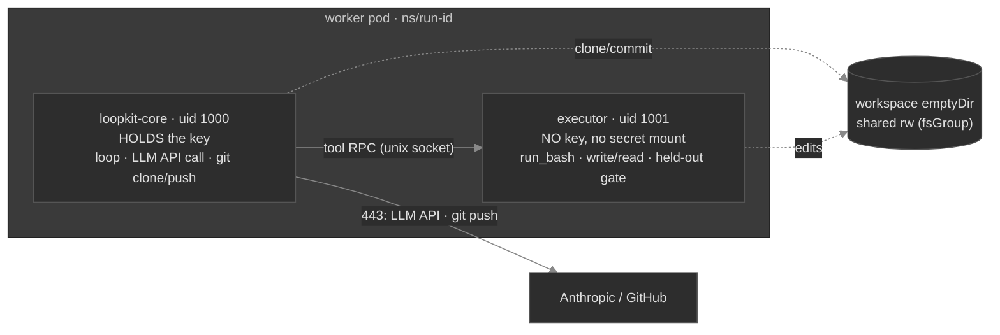

# Phase 6 — Agent isolation (the sidecar / keyless-executor split)

> **Built 🟢 (2026-06-21).** The `ToolExecutor` seam, the `RemoteToolExecutor` + `loopkit executor`
> socket server, the two-container worker pod, and the worker wiring all landed; 261 tests green
> (token-free). It closes the one residual Phase 5a could not close in a single container (a same-uid
> `ptrace` of the in-process key) for the cloud worker by construction.
>
> **One refinement from the design below (intentional, see "What it replaces"):** we **kept**
> `secrets.py`'s load-shred + `child_env` scrub rather than deleting them globally. They are the only
> containment for the two tiers that have **no sidecar** — the **CI deployment tier** (5c, an untrusted
> issue-triggered run with the API agent in-process) and untrusted **local** runs. The sidecar is the
> cloud-worker kernel boundary; the in-process shred/scrub stay as the everywhere-else mitigation (and
> are harmless/redundant inside the split). What the worker pod *did* drop is the **init-container →
> tmpfs → shred delivery**: loopkit-core now gets creds via a normal `envFrom`, the executor gets none.
>
> Build order below: steps 1–4 done; step 5's simplification was applied as the *pod-spec* change
> (drop the init/tmpfs), not a `secrets.py` deletion (per the refinement). The **live DOKS proof**
> (ptrace from the executor fails; the run still completes) awaits a cluster — like the rest of Part III.

## Why (the residual this closes)

Phase 5a withholds the key from a prompt-injected agent by **mitigation**: load the key off a
memory-tmpfs into loopkit's heap, then `os.remove` the files + scrub `os.environ` *before* any agent
code runs, and scrub every untrusted-driven subprocess's env. That is correct but has two weaknesses:

1. **It's timing-dependent.** The guarantee holds only because `secrets.install` runs before the first
   subprocess. One refactor that moves a spawn earlier silently reopens the hole.
2. **A same-uid read survives.** The agent's `run_bash` runs as the *same uid* as loopkit, so a
   `ptrace`/`process_vm_readv` of loopkit's heap (where the SDK client holds the key) is not blocked by
   env/file scrubbing or `RuntimeDefault` seccomp.

The elegant, standard fix is **isolation by construction**: run the untrusted tool-execution surface as
a **different identity that never has the key**. Then there is nothing to ptrace and nothing to shred —
the boundary is enforced by the kernel, not by code ordering.

## Topology (worker pod only — the coordinator is unchanged)

- **`loopkit-core`** (uid 1000) holds the credential via a normal mount — it runs **only trusted code**:
  the loop controller, the LLM API call, and git clone/push. It never executes a model-chosen command.
- **`executor`** (uid 1001) has **no credential** — it runs the untrusted surface (`run_bash`,
  `write_file`/`read_file`, the held-out gate) against the shared workspace. It's a tiny socket server
  (`loopkit executor`) wrapping the **existing** `_WorkspaceTools` + `ShellGate` verbatim.
- The **creds mount is `loopkit-core` only**; the **workspace** emptyDir is shared (fsGroup) so
  loopkit-core can clone/commit and the executor can apply edits.

## The seam (extend at the seam, `None`-safe)

A `ToolExecutor` protocol — `dispatch(name, args) -> (output, is_error)` and `run_gate(command) ->
GateResult`:

- **`LocalToolExecutor`** — the current in-process `_WorkspaceTools`/`ShellGate`. The **default**; local
  `loopkit run` and the dev fleet keep it (trusted context, no split). Exact prior behavior.
- **`RemoteToolExecutor`** — a Unix-socket client. The **cloud worker injects it**; `_APIAdapter.act`
  calls `executor.dispatch(...)` instead of an in-process tool call, and `run_loop` calls
  `executor.run_gate(...)`.

The API adapter + `run_loop` take an injected executor (default = `Local`) — so the split is a
cloud-only wiring choice, and nothing changes for the single-loop/dev path.

## Security properties (precise)

- **Closes the key-read residual.** uid 1001 (no `CAP_SYS_PTRACE`) cannot ptrace uid 1000; in a separate
  PID namespace it cannot even see loopkit-core's PID or read `/proc/<pid>/mem`/`environ`. The key is
  never in the executor's env, files, or address space.
- **Structural, not timing-dependent** — kernel-enforced regardless of code ordering.
- **Does NOT close (same-pod):** the executor shares loopkit-core's **network namespace**, so it keeps
  the same 443 egress and could still exfil *data it holds* (workspace/issue text) — **not the key**.
  Already bounded by FQDN egress + the pre-push secret scan. A **separate-pod** split (own netns) would
  close egress too, at the cost of cross-pod IPC — deferred.
- **CLI adapters stay refused on triggers** — a vendor binary runs its loop internally, so its tool
  execution can't be relocated to a keyless executor. Unchanged.
- **Adjacency closed (security review, Finding A).** The invariant is "untrusted code never runs as uid
  1000 in loopkit-core's namespace." One path re-opened it: loopkit-core runs `git` in the **shared
  workspace**, and the executor can write `.git/` there — a planted `.git/hooks/*` or injected
  `.git/config` would have executed as the key-holder on the next commit/push. Closed by pinning
  `core.hooksPath=/dev/null` + `core.fsmonitor=false` and resetting the credential-helper list on every
  loopkit-core git call (`durability.HARDENED_GIT_FLAGS` / `remote.run_git`), plus marking loopkit-core
  **non-dumpable** (`prctl(PR_SET_DUMPABLE,0)`) so even a same-uid neighbour can't read its heap/`environ`
  regardless of node `ptrace_scope`. See [`part-iii-security-review.md`](part-iii-security-review.md).

## What it replaces (the simplification)

- **DELETE** the init-container→tmpfs→**shred** delivery: loopkit-core gets a normal creds mount (it runs
  no untrusted code); the executor has none. The fragile load-ordering guarantee is gone.
- **DELETE** the agent-side env scrub of `run_bash`/gate — the executor is keyless, so there's nothing to
  scrub. (`child_env(add=GIT_ENV)` stays for loopkit-core's *own* git.)
- **Redaction** becomes a true optional backstop (the executor can't surface the key).
- **KEEP** (orthogonal to the split): the resolver/projection/per-submitter model, RBAC, FQDN egress,
  the pre-push scan, the securityContext.

Net: comparable LOC, but a **kernel-enforced boundary** in place of a best-effort mitigation — stronger
guarantee *and* a simpler mental model ("the untrusted thing has no key" vs "we shred the key in time").

## Resolved decisions (as built)

1. **Native sidecar.** The executor is an `initContainer` with `restartPolicy: Always` (native sidecar,
   stable since k8s 1.29) — it starts before loopkit-core and the kubelet terminates it when loopkit-core
   exits, so the `Job` still completes. **DOKS k8s-version dependency:** native sidecars need ≥ 1.29 —
   **confirm on the real cluster** (provision the node pools at a supported version). Belt-and-braces:
   the executor also exits cleanly on SIGTERM (the `loopkit executor` command unlinks the socket).
2. **Transport: Unix socket on a shared emptyDir** (`/var/run/loopkit-exec/exec.sock`, mode `0660`,
   group-connectable via the pod `fsGroup`). Length-prefixed JSON frames, one request per connection.
3. **Workspace ownership: shared `fsGroup` 1000.** loopkit-core = uid 1000, executor = uid 1001, both
   gid 1000; both entrypoints `umask 002` so the clone (core) and edits (executor) are group-writable.
   loopkit-core owns `.git` and runs all git, so no dubious-ownership error; the executor sets
   `GIT_CONFIG safe.directory=*` so an agent `git` call doesn't trip on the cross-uid tree. *Confirm the
   group-writable tree behaves on a live pod.*
4. **Gate runs in the executor** (it runs agent-authored tests); the **protected-path guard +
   commit-every-tick stay in loopkit-core** (trusted), operating on the shared workspace — only the
   *gate command* and the *tool calls* are dispatched. As built.
5. **Executor failure → tick error, not a crash.** `RemoteToolExecutor` degrades an unreachable executor
   to a tool `is_error` / a failed `GateResult` ("executor unavailable"), so the loop's stops handle it
   rather than the run dying on a transport hiccup. The Job's `backoffLimit` still owns pod-level retries.

## Build order (✅ done)

1. ✅ `ToolExecutor` protocol + `LocalToolExecutor` in new core **`executor.py`** — `_WorkspaceTools`
   moved there (re-exported from `agent.py`); `_APIAdapter`/`ShellGate`/`run_loop` take an injected
   executor (default `Local`). Existing tests unchanged.
2. ✅ `RemoteToolExecutor` (length-prefixed JSON over a Unix socket, degrade-on-unreachable) + a
   `serve()` server + the `loopkit executor` CLI command → token-free socket round-trip tests
   (`tests/test_executor.py`).
3. ✅ `cloudrun._pod_spec`: two containers + shared workspace/socket emptyDirs + native sidecar; creds
   `envFrom` into loopkit-core only; **dropped the init/tmpfs/shred container**.
4. ✅ Wire the cloud worker (`fleet worker --executor-socket` → `make_repo_runner` → `build_agent` +
   `run_loop`); local/dev stays `Local`.
5. ✅ *Pod-spec* simplification applied (drop the init/tmpfs delivery). **`secrets.py` kept** (the
   load-shred + `child_env` scrub remain the containment for the no-sidecar CI/local tiers — the
   refinement in the header). loopkit-core's git still uses `child_env(add=GIT_ENV)`.
6. ✅ Docs (this doc; 04 residual → *closed for the cloud worker*; 02 topology; 03 delivery; resume) +
   memory.

## Acceptance

- **Token-free:** the API adapter drives tools through an injected `RemoteToolExecutor` (a fake socket
  peer); the executor server runs `_WorkspaceTools` correctly over the socket; the pod spec asserts two
  containers, the key mounted **only** in loopkit-core, and a native sidecar.
- **Live (DOKS):** in a hijacked run, `cat /proc/<loopkit-core-pid>/mem` / `environ` from the executor
  container **fails** (separate PID namespace), and the run still completes (branch + draft PR).
