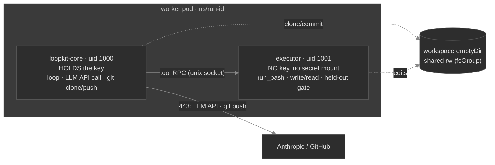

# Phase 6 — Agent isolation (the sidecar / keyless-executor split)

> **Designed, NOT built — the next-session plan.** Read this first when picking up agent isolation.
> It closes the one residual Phase 5a could not close in a single container, and it *replaces* the
> fragile ordering-dependent credential-shred with a real kernel boundary. Independent of Phase 5b
> (skills repo) — can be done before or after it.

## Why (the residual this closes)

Phase 5a withholds the key from a prompt-injected agent by **mitigation**: load the key off a
memory-tmpfs into loopkit's heap, then `os.remove` the files + scrub `os.environ` *before* any agent
code runs, and scrub every untrusted-driven subprocess's env. That is correct but has two weaknesses:

1. **It's timing-dependent.** The guarantee holds only because `secrets.install` runs before the first
   subprocess. One refactor that moves a spawn earlier silently reopens the hole.
2. **A same-uid read survives.** The agent's `run_bash` runs as the *same uid* as loopkit, so a
   `ptrace`/`process_vm_readv` of loopkit's heap (where the SDK client holds the key) is not blocked by
   env/file scrubbing or `RuntimeDefault` seccomp.

The elegant, standard fix is **isolation by construction**: run the untrusted tool-execution surface as
a **different identity that never has the key**. Then there is nothing to ptrace and nothing to shred —
the boundary is enforced by the kernel, not by code ordering.

## Topology (worker pod only — the coordinator is unchanged)

- **`loopkit-core`** (uid 1000) holds the credential via a normal mount — it runs **only trusted code**:
  the loop controller, the LLM API call, and git clone/push. It never executes a model-chosen command.
- **`executor`** (uid 1001) has **no credential** — it runs the untrusted surface (`run_bash`,
  `write_file`/`read_file`, the held-out gate) against the shared workspace. It's a tiny socket server
  (`loopkit executor`) wrapping the **existing** `_WorkspaceTools` + `ShellGate` verbatim.
- The **creds mount is `loopkit-core` only**; the **workspace** emptyDir is shared (fsGroup) so
  loopkit-core can clone/commit and the executor can apply edits.

## The seam (extend at the seam, `None`-safe)

A `ToolExecutor` protocol — `dispatch(name, args) -> (output, is_error)` and `run_gate(command) ->
GateResult`:

- **`LocalToolExecutor`** — the current in-process `_WorkspaceTools`/`ShellGate`. The **default**; local
  `loopkit run` and the dev fleet keep it (trusted context, no split). Exact prior behavior.
- **`RemoteToolExecutor`** — a Unix-socket client. The **cloud worker injects it**; `_APIAdapter.act`
  calls `executor.dispatch(...)` instead of an in-process tool call, and `run_loop` calls
  `executor.run_gate(...)`.

The API adapter + `run_loop` take an injected executor (default = `Local`) — so the split is a
cloud-only wiring choice, and nothing changes for the single-loop/dev path.

## Security properties (precise)

- **Closes the key-read residual.** uid 1001 (no `CAP_SYS_PTRACE`) cannot ptrace uid 1000; in a separate
  PID namespace it cannot even see loopkit-core's PID or read `/proc/<pid>/mem`/`environ`. The key is
  never in the executor's env, files, or address space.
- **Structural, not timing-dependent** — kernel-enforced regardless of code ordering.
- **Does NOT close (same-pod):** the executor shares loopkit-core's **network namespace**, so it keeps
  the same 443 egress and could still exfil *data it holds* (workspace/issue text) — **not the key**.
  Already bounded by FQDN egress + the pre-push secret scan. A **separate-pod** split (own netns) would
  close egress too, at the cost of cross-pod IPC — deferred.
- **CLI adapters stay refused on triggers** — a vendor binary runs its loop internally, so its tool
  execution can't be relocated to a keyless executor. Unchanged.

## What it replaces (the simplification)

- **DELETE** the init-container→tmpfs→**shred** delivery: loopkit-core gets a normal creds mount (it runs
  no untrusted code); the executor has none. The fragile load-ordering guarantee is gone.
- **DELETE** the agent-side env scrub of `run_bash`/gate — the executor is keyless, so there's nothing to
  scrub. (`child_env(add=GIT_ENV)` stays for loopkit-core's *own* git.)
- **Redaction** becomes a true optional backstop (the executor can't surface the key).
- **KEEP** (orthogonal to the split): the resolver/projection/per-submitter model, RBAC, FQDN egress,
  the pre-push scan, the securityContext.

Net: comparable LOC, but a **kernel-enforced boundary** in place of a best-effort mitigation — stronger
guarantee *and* a simpler mental model ("the untrusted thing has no key" vs "we shred the key in time").

## Open decisions (resolve next session)

1. **Native sidecars vs Job completion.** A long-running sidecar blocks `Job` completion on old k8s. Use
   a **native sidecar** (an `initContainer` with `restartPolicy: Always`, stable in k8s 1.29) — **confirm
   the DOKS k8s version supports it**; else the executor must exit when loopkit-core signals done (a
   done-file or socket close). *This is the load-bearing dependency.*
2. **Transport:** Unix socket on a shared emptyDir (recommended — no netns dependency, file-perm gated)
   vs localhost TCP.
3. **Workspace ownership:** loopkit-core clones, the executor edits → a shared `fsGroup` with both uids in
   the group; pick the gid model and confirm git is happy with group-writable trees.
4. **Gate + safety location:** the gate runs in the executor (it runs agent-authored tests). Confirm the
   protected-path guard + commit-every-tick stay in **loopkit-core** (trusted) operating on the shared
   workspace, with only the *gate command* dispatched to the executor.
5. **Executor failure handling:** crash → tick error vs run failure; restart/backoff semantics.

## Build order

1. `ToolExecutor` protocol + `LocalToolExecutor` — refactor `_WorkspaceTools`/`ShellGate` behind it
   (default; existing tests unchanged).
2. `RemoteToolExecutor` + a `loopkit executor` socket server (reuses `_WorkspaceTools`/`ShellGate`
   verbatim) → token-free socket round-trip tests.
3. `cloudrun._pod_spec`: two containers + shared workspace + native sidecar + creds mount in
   loopkit-core only; **drop the init/tmpfs/shred**.
4. Wire the cloud worker to inject `RemoteToolExecutor`; local stays `Local`.
5. Simplify `secrets.py` (drop the shred; keep `child_env` for loopkit-core's git) + remove the agent scrub.
6. Docs (04 residual → *closed for the API-adapter path*; 02 topology) + memory.

## Acceptance

- **Token-free:** the API adapter drives tools through an injected `RemoteToolExecutor` (a fake socket
  peer); the executor server runs `_WorkspaceTools` correctly over the socket; the pod spec asserts two
  containers, the key mounted **only** in loopkit-core, and a native sidecar.
- **Live (DOKS):** in a hijacked run, `cat /proc/<loopkit-core-pid>/mem` / `environ` from the executor
  container **fails** (separate PID namespace), and the run still completes (branch + draft PR).
