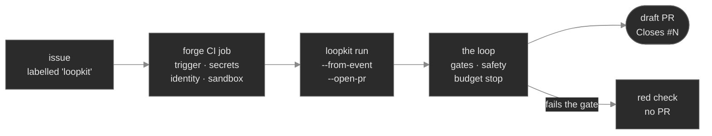

# Part III — Looping in the GitHub/GitLab ecosystem

> **A teaching module, with two runnable labs.** Parts I–II built a trustworthy single loop and a way
> to run many of them. This module is about where that loop *lives* in the real world: a forge
> (GitHub/GitLab) is not just where your code sits — it's a ready-made **trigger, secret store,
> identity provider, and sandbox**. Learning to lean on those primitives is what turns "a loop on my
> laptop" into "a loop that picks up issues on a real project." Watch it run: **`loopkit demo 20`**
> (triggers) and **`loopkit demo 21`** (the CI tier); add `--live` to the CI lab to have claude-code
> solve a real issue.

## Why this module exists

A coding loop is only useful if something *feeds* it work and something *carries away* its result. In
Parts I–II that something was you (a human typing `loopkit run`) or an in-process coordinator. On a
real project the natural feeder is the **forge**: an issue describes a task, and a merged PR is the
result. The whole discipline of this module is one principle:

> **Use the platform's primitives first.** Before you build a trigger, a secret store, an identity
> system, or a sandbox, check whether the forge already gives you one. It almost always does, and the
> forge's version is battle-tested, free, and one fewer thing you operate.

The pull toward re-building these yourself is strong (it feels like "real" infrastructure). Resisting
it is the difference between a weekend-usable tool and a Kubernetes project you have to babysit.

## The three deployment tiers

loopkit runs at three escalating tiers. They share the **same loop core** — the gates, the held-out
acceptance check, the three hard stops, the durable branch, the blast-radius envelope from Parts I–II
are *identical* in all three. Only the **trigger, secrets, and isolation** differ, and the tier you
pick is just "how much does the forge give me, and how much do I hand-build?"

| Tier | What runs | Trigger | Secrets | Isolation | Reach for it when |
|---|---|---|---|---|---|
| **Local** | `loopkit run` on a laptop | a human | local env | the laptop | iterating by hand |
| **CI** | `loopkit run` in a CI job | forge issue / cron / manual | **CI-native** (masked vars / OIDC) | the **ephemeral runner** | hands-off issue→PR, **no cluster** |
| **Cloud fleet** | coordinator + worker Jobs on k8s | CLI / CronJob / **webhook** | per-submitter resolver + sidecar | namespace + container split | many concurrent runs, `evolve`, multi-tenant |

The arc of the table is *delegation shrinking*: local delegates everything to you; CI delegates to the
forge; the cloud fleet delegates to nothing — it hand-builds the trigger (a webhook listener), the
secrets (a per-submitter resolver), the identity (an issue-author binding), and the isolation (a
per-run namespace). **Each row down is more power and more to operate.** Start at the top; descend only
when a real need pushes you.

## What each primitive maps to

The same four jobs exist in every tier — the only question is *who provides them*:

| Primitive | Local | CI tier | Cloud fleet |
|---|---|---|---|
| **Trigger** (what starts a run) | you type it | the forge's `on: issues` / pipeline | a webhook listener / CronJob → `create_run` |
| **Secrets** (the key it spends) | your shell env | masked CI variables | a k8s Secret resolved per submitter, shredded after load |
| **Identity** (whose key / who's accountable) | you | the repo (per-repo keying) | the **issue author**, bound before the run starts |
| **Sandbox** (blast-radius containment) | your working copy | the throwaway runner | a per-run namespace + (next) a keyless-executor container |

Read the CI column top to bottom: **every cell is "the forge."** That is the entire reason the CI tier
needs no infrastructure — loopkit supplies only the loop, and the forge supplies the rest.

## The CI tier in depth (lab: `loopkit demo 21`)

This is the tier you'll use first on a real repo. A labelled issue starts a CI job; the job runs one
`loopkit run`; the result is a **draft** PR that closes the issue on merge.



The three new flags that make this work (all on the single-loop `loopkit run` path):

- **`--from-event <path>`** — read the forge's issue-event JSON (Actions writes it to
  `$GITHUB_EVENT_PATH`) and set the goal to the issue's `title + body`. `triggers.parse_event_payload`
  auto-detects GitHub vs GitLab by the body's shape (GitLab carries a top-level `object_kind`), so the
  *same* issue→goal mapping serves both forges and the webhook tier.
- **`--from-issue <n>` `--provider`** — fetch one issue by number via `gh`/`glab` (`issues.fetch_issue`).
  The manual/scheduled path, and a clean local convenience.
- **`--open-pr`** — flip `[remote]` on for this one invocation (push + a **draft** PR), threading the
  issue number into `remote.sync_done(issue=N)` so the PR body carries `Closes #N`. Turnkey on a repo
  whose `loopkit.toml` leaves remote off (the safe default).

Draft, always: **the loop proposes, a human merges.** Everything else — branch-only push, the
protected-path guard, the held-out gate, the budget stop — is the unchanged Parts I–II envelope. In CI
the runner *is* the Ch 16 sandbox, so loopkit doesn't build one.

**And the loop follows through.** The PR isn't the end of the lifecycle: **request changes** on a
loopkit PR and the same workflow dispatches a **revise run** — the review becomes the goal, the run
resumes the PR's *existing* head branch, and the push updates the *same* PR. Idempotency inverts for
this lane (one run **per review round**, not one-ever-per-issue), and containment is the branch
prefix: the loop only revises `loopkit/*` branches — its own PRs, never a human's. See
[`part-iii-ci-mode.md` → Revise runs](part-iii-ci-mode.md#revise-runs--the-post-pr-follow-through-).

### GitHub vs GitLab — the honest differences

| | GitHub Actions | GitLab CI |
|---|---|---|
| **Issue → job** | native: `on: issues: [opened, labeled]` | **no native issue trigger** — use manual *Run pipeline* (pass `ISSUE_IID`), a webhook→trigger token, or a schedule |
| **Goal source** | `--from-event "$GITHUB_EVENT_PATH"` | `--from-issue "$ISSUE_IID" --provider gitlab` |
| **Push/PR token** | the job's scoped `github.token` (`GH_TOKEN`) | a `GITLAB_TOKEN` PAT (`api` scope) — drives `glab` *and* the git push |
| **Adapter** | `claude-api` — no binary to install or auth in CI | same |

`claude-api` is the lower-friction CI default everywhere: `pip install` + a key, no agent binary. (The
loopkit credential hygiene from Phase 5a still applies — `glab`/git get the token re-injected into
loopkit's *own* forge subprocess, while the agent's shell is scrubbed.)

## Triggers as infrastructure (lab: `loopkit demo 20`)

The CI tier delegates the trigger to the forge's CI. The **cloud fleet** tier, by contrast, builds the
trigger itself: a **webhook listener**. That's worth understanding even if you stay on the CI tier,
because it's where the *cost* of owning a trigger shows up — the moment your trigger is a public HTTP
endpoint, two new problems appear that an in-cluster queue never had:

- **Authentication, fail-closed.** An unsigned or mis-signed POST must never start a paid run. GitHub
  HMAC-signs each delivery body under a shared secret (`X-Hub-Signature-256`); the listener recomputes
  it and compares in constant time. Every failure mode returns "reject." GitLab is weaker — it sends a
  static *token* not bound to the body, so a leaked token is directly replayable; a GitLab listener
  therefore pins its own identity rather than trusting the payload's claimed author.
- **Idempotency.** Forges re-deliver (any non-2xx, any timeout), and one issue emits several matching
  events (`opened`, then `labeled`). The listener dedupes on the **issue identity** (`repo#number`), so
  one issue maps to **at most one run** — no matter how many deliveries arrive.

`loopkit demo 20` drives the pure `WebhookApp.dispatch` through seven deliveries — forged → 401/no-run,
signed → one run, retry + second event → dedup, unlabelled → ignored, a changes-requested review →
a **revise** event (per-round dedupe key; deferred to the CI tier) — and shows the run count never
exceeds one. Crucially, the listener, the CronJob, and the CLI all converge on the **same
`create_run()` seam**: a human, a cron, and a webhook are one code path with identical isolation. That
is Chapter 12's "the worker is indifferent to what woke it," made into infrastructure.

## See it in action

```bash
loopkit demo 20      # triggers: a signed webhook → exactly one run per issue (scripted)
loopkit learn 20     # same, paused between beats

loopkit demo 21      # the CI tier: an issue → a draft PR, no cluster (scripted)
loopkit demo 21 --live   # claude-code actually solves the issue in a temp repo

loopkit demo 22      # cloud-tier hardening: the agent's tools run in a keyless executor (scripted)
```

All three are token-free by default (`MockAgent` + the demo-repo's real pytest gates). `demo 20`/`demo
22` are scripted-only — they teach *plumbing* (auth/idempotency; the isolation boundary), not the agent
— exactly as `demo 12` (the fleet) is. `demo 21` runs the real loop, so `--live` swaps in claude-code.
`demo 22` shows the **cloud tier's** agent-isolation split: loopkit-core holds the key, but the agent's
`run_bash` + the held-out gate are dispatched to a separate **keyless executor** (a different uid/PID
namespace in the pod) — so a `printenv` of the key finds nothing. See
[`part-iii-agent-isolation.md`](part-iii-agent-isolation.md) and
[`architecture/04-security.md`](architecture/04-security.md).

## Run it on a real project

The CI tier is meant to be reached for on day one of a real repo:

```bash
loopkit init --ci github     # scaffold .github/workflows/loopkit.yml + a starter loopkit.toml/PROMPT.md
# add the repo secret ANTHROPIC_API_KEY, edit the two gates in loopkit.toml, commit
# then: open an issue, add the `loopkit` label, watch a draft PR appear
```

`loopkit init --ci gitlab` does the GitLab equivalent (`.gitlab-ci.yml`). The canonical templates also
live in [`../examples/ci/`](../examples/ci/) with full setup notes. For the broader "run loopkit on your
own repo" walkthrough (gates, steering files, the fleet-from-issues path), see
[`USING-ON-YOUR-REPO.md`](USING-ON-YOUR-REPO.md) and [`CONTROL-FILES.md`](CONTROL-FILES.md).

## One caveat to carry forward

CI secrets are **repo/environment-scoped**, so a CI run spends the *repo's* key, attributed to the run
— **not** to the engineer who filed the issue. Per-submitter keying and cost caps are a **cloud-tier**
feature (the resolver that binds a run to its issue author). The CI tier documents this difference
rather than faking it: if you need per-engineer attribution or many concurrent `evolve` runs, that's
the signal to descend to the cloud fleet tier — see [`part-iii-resume.md`](part-iii-resume.md) and the
[architecture wiki](architecture/README.md).

## In the curriculum

loopkit is the **runnable reference implementation** of the *Agentic Loops* engineering manual; this
module mirrors its two ecosystem chapters, and the labs are the chapter demos:

| Course chapter | This module / lab |
|---|---|
| **Ch 20 — Triggers as Infrastructure** | the webhook section above · `loopkit demo 20` (incl. the revise beat) |
| **Ch 21 — The CI Deployment Tier** | the three tiers + the CI tier above · `loopkit demo 21` |

The manual's chapters teach the *concept* against a minimal stdlib harness; this doc and the labs are
the *production* realization. (The manual lives in the tutor curriculum under `loops/20`–`loops/21`.)

The manual now also teaches the **post-PR follow-through** as foundational — a loop's job isn't "open a
PR," it's "get a change merged," and a human's changes-requested review is a fresh goal. That's this
repo's [revise run](part-iii-resume.md) (`triggers.parse_review_event` + `run --from-event`, one run per
review round, gated to `loop/*` branches, never on CI failure), mirrored in `demo 20`'s revise beat.

**The full concept→loopkit map** — which manual idea and capstone artifact becomes which loopkit part,
when to graduate, and where the two repos meet at the frontier (oracle synthesis, the bounded note
channel, semantic stops) — is the manual's `loops/graduating-to-loopkit.md` (in the tutor curriculum,
alongside `loops/20`–`loops/21`). It's the two-way pairing link: read the manual to learn the pattern,
then that map to find its production form here. (The manual is a separate repo, so this is a textual
pointer, not a link.)
