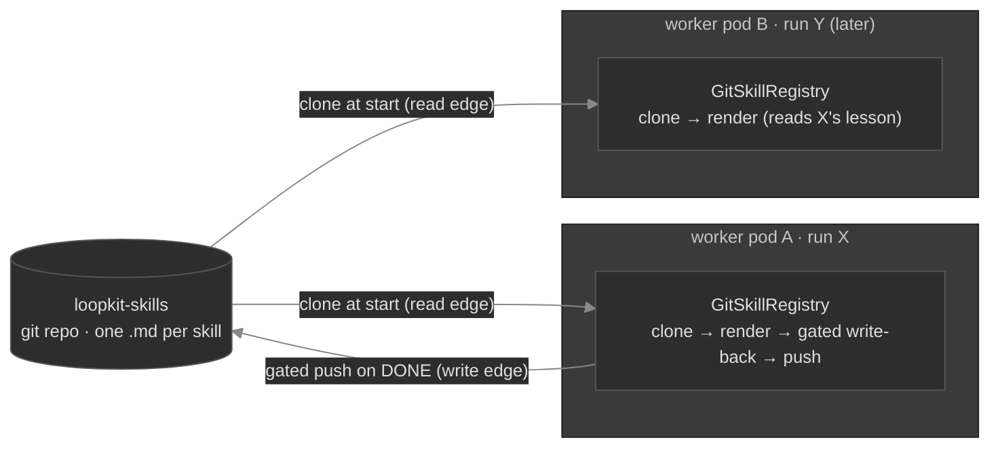

# Phase 5b — The skills repo (the cross-run flywheel, durable across machines)

> **Built 🟢 (2026-06-21).** The git-backed `GitSkillRegistry`, the `fleet worker --skills-repo`
> wiring, and the `cloud run` / `RunSpec` / `worker_command` plumbing all landed; **264 tests green**
> (token-free, +12). It gives the Ch 17 write-back flywheel a durable home on the cloud fleet, where
> every worker is its own ephemeral pod sharing no filesystem. Demonstrated by the runnable
> `loopkit demo 23`. The only live-pending piece is pointing it at a real GitHub `loopkit-skills` repo
> (needs the remote + a cluster) — the mechanics are proven end-to-end against a local bare repo.

## Why (the gap this closes)

Ch 17 built the flywheel — distil a solved run into a named **skill**, render it into future prompts,
gains compound — and `FileSkillRegistry` made it durable across *processes on one filesystem*. That is
exactly what the cloud fleet **doesn't** have: every worker is an ephemeral pod with its own `emptyDir`,
thrown away on completion (durability is via the git push, by design — see
[`02`](architecture/02-cloud-architecture.md#storage-model--almost-nothing-is-persistent-by-design)).
A lesson written to a pod's local disk dies with the pod, so the flywheel never turns across runs.

The fix is the one already decided in the storage model: **a dedicated `loopkit-skills` git repo** as
the durable, *shared* home. Git is the right substrate — it is the fleet's existing durability and auth
mechanism, it's versioned and reviewable (a learned lesson is a reviewable commit, not an opaque row),
and it needs **zero new infrastructure** (no database, no shared PVC — DO block storage is RWO anyway).

## How (the registry is the seam — the loop is unchanged)

The loop's two attach points are untouched: `prompt.build_prompt` still renders `skills.render()`, and
`run_loop`'s DONE path still calls `skills.write_back(...)`. Phase 5b is a **new `SkillRegistry`
implementation** that adds a git transport around the existing file storage — composition, not a fork:

- **`GitSkillRegistry`** (`extensions/skills.py`) composes a `FileSkillRegistry` over a cloned working
  tree. On construction it **clones/pulls** the repo (so `render()`, called every tick, reads the
  accumulated lessons off the local clone — no per-tick network). `write_back` delegates to the file
  registry (which applies the **write-back gate** and stores the `.md`) and, only when a skill is minted,
  **commits + pushes** it back.
- **Bounded growth** (review Finding G). The per-task clone is **shallow** (`--depth 1`) — only the tip
  is ever rendered, never the history — and `render()` is **render-budget bounded** (`_MAX_RENDER`, 12 KB)
  atop the per-skill `_MAX_GUIDANCE` (2 KB) cap, dropping the tail with a visible `_[N more … omitted]_`
  note. The shallow boundary is exactly the merge-base the file-disjoint concurrent rebase needs, so the
  retry below still works against a shallow clone. (A *relevance-ranked* render — closest to *this* goal,
  not the first name-sorted N — is the deferred richer step.)
- **`GitTransport`** is an injected seam (`pull`/`push`). The default `_SubprocessGitTransport` shells
  out to `git`, reusing `remote.run_git`'s credential hygiene (scrubbed env + the env-fed credential
  helper, never a token in argv) and `remote.sanitize_git_url`. It **never force-pushes**, and every
  step is **best-effort**: a transport failure logs `WARN` and returns `False` rather than raising —
  a skill that fails to propagate must never fail the run that already reached DONE.
- **Concurrent workers, one repo.** Skills are one file per name, so a non-fast-forward push (another
  pod landed a different skill first) is resolved by `fetch` + `rebase origin/<branch>` + retry — the
  writes are file-disjoint, so the rebase doesn't conflict, and both lessons survive.

## The two attach points the worker wires

- **`make_repo_runner(skills_repo=…, skills_branch=…)`** (`extensions/fleet.py`): when set, each task
  builds a `GitSkillRegistry` cloned into its **own scratch** (`scratch/skills-repo`, kept out of the
  target clone so a skill can never land on the work branch) and passes it to `run_loop(skills=…)`.
  `None` ⇒ no skills, exact prior behavior.
- **`fleet worker --skills-repo / --skills-branch`** (env `LOOPKIT_SKILLS_REPO` / `LOOPKIT_SKILLS_BRANCH`)
  → the cloud path threads them through `RunSpec.skills_repo/skills_branch` → `worker_command` carries
  `--skills-repo`. Only the **worker** gets them — the coordinator does no write-back.

## Resolved decisions (as built)

1. **Storage = git repo, one `.md` per skill** (reuses `FileSkillRegistry`'s on-disk format verbatim).
   No new datastore. The skills repo is loopkit's own learned-state store, separate from any target repo.
2. **Direct push to a configurable branch (default `main`), not a PR-per-skill.** The skills repo is
   loopkit's *own* state store (like a database), distinct from a target repo whose `main` is sacred — so
   the Ch 16 "never `main`" envelope (about the **target** repo) does not apply here. A PR-per-skill would
   gate the flywheel behind a human merge and defeat the compounding. The write-back **gate** is the
   guard, and git history keeps every skill reviewable/revertible.
3. **Gated, never ungated (Ch 17 carried forward).** The worker sets the write-back gate to the held-out
   **acceptance gate**, so only a run that clears held-out tests teaches the shared repo. It re-runs once
   on the (rare) DONE path — redundant with the loop's own acceptance pass, but the literal honoring of
   the rule; a *stricter* learn-worthiness gate is a drop-in. On the cloud it carries the same `executor`,
   so it runs in the keyless sidecar (Phase 6) like every other agent-influenced command.
4. **Credentials: reuse loopkit-core's git token, add nothing.** The push runs in `run_loop`'s DONE
   path, inside the trusted, key-holding **loopkit-core** container (Phase 6) — never the agent's reach.
   No new Secret; the skills repo host (github.com) is already in the per-run FQDN egress allowlist.
5. **Clone-per-task.** Each task gets a fresh clone (mirrors the per-task target clone). Simple and
   correct; a long-lived cached clone is a later optimization, not needed for v1.
6. **Best-effort, never fatal.** Clone/pull/push degrade to a `WARN` + `False`; the run's outcome (the
   branch + draft PR) is the real deliverable and must never hinge on the skills sync.
7. **Content is attacker-influenced → bounded + scrubbed (security review, Finding B).** A skill derives
   from the goal (an issue body on trigger paths) and is rendered into **every future run's** prompt, so
   it is a stored-injection surface. `_sanitize_skill` (in `_vet`, all tiers): **refuse** a skill carrying
   a credential-shaped value, **cap** length + strip control chars; the default distiller **quotes a
   truncated goal as provenance** (not a raw imperative); the rendered header is **advisory, not
   authoritative**. The blast-radius control is **per-tenant namespacing** — a separate `--skills-repo`/
   `--skills-branch` per tenant, so a poisoned skill only re-enters its own runs; **recommended for
   multi-tenant**, since direct-push-to-`main` (decision 2) is only safe single-tenant. Content
   sanitization is a mitigation, not a boundary — see [`part-iii-security-review.md`](part-iii-security-review.md).

## Build order (✅ done)

1. ✅ `remote.run_git(repo, *args, authenticated=…)` — the single git-with-hygiene entrypoint (`_git`/
   `_git_auth` refactored onto it) so the skills transport reuses it with no duplication.
2. ✅ `GitTransport` + `_SubprocessGitTransport` (clone-or-pull, gated commit + push with rebase-retry,
   best-effort) + `GitSkillRegistry` (composition, injectable transport) in `extensions/skills.py`.
3. ✅ `make_repo_runner(skills_repo=…)` builds the registry per task → `run_loop(skills=…)`; `None`-safe.
4. ✅ CLI: `fleet worker --skills-repo/--skills-branch`; `cloud run --skills-repo/--skills-branch` →
   `RunSpec` → `worker_command` (worker only).
5. ✅ Tests (`tests/test_skills_repo.py`, 12): the full flywheel through `run_loop` against a real local
   bare repo (run A pushes → run B reads + solves tick 1), gated/idempotent/bootstrap/rebase-race, the
   injectable-transport unit checks, and the `worker_command`/`coordinator_command` wiring.
6. ✅ Lab `loopkit demo 23` (two pods sharing only a git repo) + docs (this doc; 01/02 wiki; resume).

## Acceptance

- **Token-free (met):** a `run_loop` that reaches DONE pushes a skill to a local bare repo, and a second
  `run_loop` with a fresh clone of that repo **renders the skill and solves on tick 1** — the literal
  "a solved run writes a skill back that a later run reads," with no tokens and no network. Gated/
  idempotent/bootstrap/concurrent-rebase all asserted; the cloud wiring asserted object-by-object.
- **Live (pending a remote + cluster):** point `--skills-repo https://github.com/<owner>/loopkit-skills`
  at a real repo; run two cloud runs and confirm the second reads the first's pushed skill, and that a
  hijacked agent's shell still cannot reach the git token doing the push.
