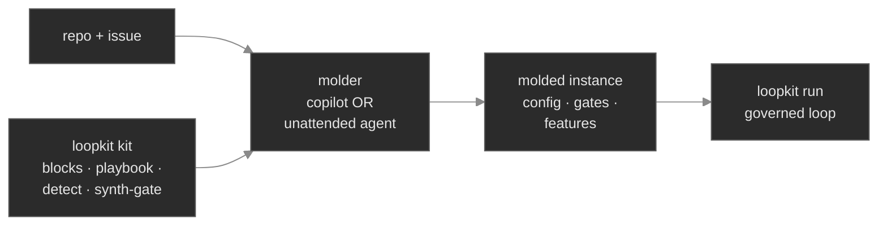

# Part IV — Molding loopkit to a repo (the molding kit)

> **Status:** 2026-07-10. **Layers 1–4 BUILT** — Layer 1 = `examples/molding/` (the `loopkit-mold`
> skill + templates, zero new code paths); Layer 2 = `loopkit synth-gate` (fail-first oracle
> verification — `extensions/synth_gate.py` + the CLI command + demo 25 + tests); Layer 3 =
> `loopkit detect` (deterministic repo introspection → a proposed `loopkit.toml` —
> `extensions/detect.py` + the CLI command + demo 26 + tests); Layer 4 = `loopkit route`
> (reliability-gated routing — `measure` pass^k → single-run vs `evolve`; `extensions/route.py` + the
> CLI command + demo 27 + tests). Layer 5 is design. This doc argues *what to build, why, and in what
> order*.
> It deliberately **supersedes** the broad "auto-molding harness / self-configuring monolith" sketch that
> preceded it — see [Why not a monolith](#why-not-a-monolith-the-design-boundary). The design decisions
> below were dialled in with the maintainer; the open questions at the end are the ones still live.

## Thesis

loopkit is already autonomous at **execution**: give it a goal + two gates and the loop drives to done
under guardrails (external gate, held-out acceptance gate, the hard stops, durable git, the blast-radius
envelope). It is **not** autonomous at **configuration**. Someone still has to write `loopkit.toml`,
`PROMPT.md`, the gates, and — in plan mode — the checklist, and decide which features to switch on
(skills flywheel, `evolve` best-of-N, `measure` calibration, worktree isolation, difficulty/model
routing, per-task protected-path unlocks). Today that someone is a human, or a Claude/Codex copilot
session driving the setup.

**That division of labor is correct, and we should lean into it — not replace it.** A coding-agent
copilot pointed at a repo already molds loopkit *better* than any rigid `loopkit auto-configure` command
could: it reads the code, applies judgment, and asks good clarifying questions. Building a monolith to do
that job worse would duplicate the copilot *and* bloat loopkit — a direct hit to the roadmap's
"keep it killer, not bloated" line.

So the molder stays the copilot (interactive), or the triggering agent (unattended). **loopkit's job is
to make that molder good and consistent** by shipping three things:

1. **Deterministic building blocks** — the reusable, repo-agnostic, *verified* parts a copilot should
   never hand-roll and would get inconsistently or dangerously wrong (gate scripts, fail-first oracle
   verification, worktree isolation, the per-issue instance skeleton).
2. **A molding playbook** — a decision guide the copilot reads: how to assemble the blocks for *this*
   repo/issue, and when to reach for each feature.
3. **Two small code primitives** that are only trustworthy as code, not prose — `loopkit detect`
   (deterministic introspection) and `loopkit synth-gate` (propose an oracle → **fail-first verify** it).

The copilot keeps the judgment; loopkit supplies the determinism, verification, and provenance the
judgment can't self-supply. The same kit works whether the molder is an interactive copilot **or** an
unattended CI/fleet agent — which is the whole point: it is the missing layer for the *no-human* tiers,
and its necessity is already proven (see below).

## Why this is valuable (and not copilot duplication)

The honest split — what a copilot already does well vs. what must be codified:

| Part of "molding" | Copilot already does it well? | Worth codifying? |
|---|---|---|
| Write `loopkit.toml` / `PROMPT.md` / checklist prose | **Yes**, interactively | No — don't duplicate the copilot |
| Judgment-y goal decomposition | **Yes** | No — leave it to whoever drives |
| **Deterministic** detection of *safety-critical* config (protected paths, test command, default branch) | No — a copilot *guesses*; an LLM must not hallucinate which paths are protected | **Yes** — trustworthy heuristics beat a guess, and they test at zero tokens |
| **Fail-first oracle verification** (run the proposed test, prove it FAILS now) | No — a copilot writes a test but rarely proves it fails-first | **Yes** — the value is the verification loop; roadmap #1 |
| **Reliability-gated routing** (`measure` pass^k → escalate to `evolve`) | No — a mechanical feedback loop | **Yes** |
| **Provenance / reproducibility** (a versioned, auditable, re-runnable molding artifact) | No — a copilot session's reasoning evaporates | **Yes** |

### The existence proof: the spacer remediation harness

`spacer-dev-stack/remediation/` is the manual version of this kit. To remediate 60+ production-readiness
audit findings *unattended*, a human hand-built:

- `ledger2issues.py` — findings → issues with a **typed Definition of Done** (a `COVERAGE_TIER_DOD`
  table maps a finding class → what its test must assert).
- 13 per-finding `configs/*.toml` — per-task gates, budget, and protected-path unlocks.
- `acceptance/<key>/` — **fail-first-verified** held-out oracles, one per finding.
- `gates/` — `has-tests.sh` (diff must ship a test), `validate.sh` (fail-first), `acceptance.sh`
  (dispatcher), `review-judge.sh` (in-loop adversarial judge), `score.sh` (evolve scorer).
- `sequencer.py` / `evolve_one.py` — the batch runner and the best-of-N evolve runner.

Every one of those is a molding building block, reinvented from scratch **because loopkit didn't ship
them**. There was no copilot per finding — 60 unattended runs can't have one. The kit generalizes exactly
that harness so the next repo doesn't rebuild it, and so the CI/fleet tiers get it for free.

## Why not a monolith (the design boundary)

The molder is **not** a loopkit subsystem. There is no `loopkit auto-configure` that swallows the
copilot's judgment. loopkit gains only:

- `examples/molding/` — the generalized, repo-agnostic building blocks.
- a `docs/` **playbook** — the recipe + the feature-routing decision guide.
- two small, opt-in CLI primitives — `detect` and `synth-gate`.

No new heavy dependency, no orchestration DSL, no first-class judge/debate framework. This is loopkit's
own **extend-at-the-seams** invariant applied to configuration: ship seams and verified primitives, let
the intelligence (copilot or unattended agent) compose them.

## The kit inventory (generalized from spacer)

### 1. Deterministic building blocks — `examples/molding/`

- `gates/has-tests.sh` — the diff must add/modify a test (test-as-you-go, repo-agnostic).
- `gates/validate.sh` — **fail-first**: the held-out oracle must FAIL on the current tree before it is
  trusted (an oracle that passes on the buggy tree certifies nothing).
- `gates/acceptance.sh` — dispatcher → `acceptance/<key>/run.sh`, keeping the held-out oracle out of the
  repo the loop can edit.
- `gates/review-judge.sh` — in-loop adversarial judge (fresh context) + a per-task `judge-rubric.md`.
- `gates/score.sh` — `evolve` candidate scorer (diff-minimality default + optional judge tier).
- `acceptance/<key>/` skeleton — `run.sh` + a test file + optional `judge-rubric.md` + optional
  `guidance.md`.
- a **worktree isolation** recipe — run per-issue in an isolated clone/worktree (the parallel/batch shape).
- a per-issue `config.toml` skeleton — gates + budget + the *minimal* protected-path unlock for the task.

**Two test sets, two purposes** (the invariant that keeps the loop honest): the held-out acceptance
oracle (ours, hidden, protects the loop from gaming its own gates) and the agent's shipped, co-located
tests (test-as-you-go, protects the repo, enforced by `has-tests.sh`). The kit keeps them separate.

### 2. The playbook — a Claude Code skill (`examples/molding/`)

The playbook ships as an **actionable Claude Code skill**, not a static doc — it auto-loads when a user
says "help me mold loopkit for this repo" and walks the copilot through the recipe below. Homing:

- **Canonical copy lives in the repo** at `examples/molding/` — that directory *is* the skill: a
  `SKILL.md` (the playbook) alongside the deterministic building blocks it references. Versioned with the
  code it molds; discoverable by anyone who clones loopkit; the on-ramp for a fresh user.
- **Global availability is a symlink, not a second copy:** `~/.claude/skills/loopkit-mold →
  <repo>/examples/molding`, so there is one source of truth and no drift. A `loopkit` one-liner can
  create the symlink.
- **Named `loopkit-mold` to avoid a collision:** this Claude Code skill is *not* loopkit's runtime skill
  flywheel (`extensions/skills.py`). The doc/README must say so, or newcomers will conflate the two.

The skill's content:

- **The molding recipe:** repo → `detect` (propose config) → the copilot refines → author + `synth-gate`
  the oracle → choose features → human review → `run`.
- **The feature-routing decision guide** — when to reach for what:

  | Reach for… | When |
  |---|---|
  | `evolve` (best-of-N + re-validation) | the task is ambiguous/hard with several plausible solutions, or calibrated pass^k is low |
  | `measure` (pass^k calibration) | gate flakiness is suspected, or before trusting a whole batch |
  | skills flywheel (per-repo/lang dir) | same-class tasks recur (sweeps) — the lessons compound |
  | difficulty → model/adapter tiering | start cheap; escalate on no-progress (a cost lever) |
  | plan mode (`--plan`) | one coherent multi-step feature (sequential backlog) — bounded by plan-stall |
  | worktree isolation / fleet | independent tasks in parallel |
  | per-task protected-path unlock | infer the *minimal* unlock from the task type (migration task → unlock `migrations/`) |

- **The coverage-tier → typed Definition-of-Done table** (generalized from spacer's `COVERAGE_TIER_DOD`):
  classify the work (`authz`, `wire-contract`, `serializer`, `silent-fallback`, `input-validation`,
  `concurrency`, `correctness`) → the tier prescribes what the acceptance test must assert. This is the
  trick that makes "propose a gate" tractable without synthesizing a test from nothing.
- **The security boundary** (below).

### 3. Code primitives

- **`loopkit detect`** ✅ **BUILT** — deterministic repo introspection (hybrid per the maintainer
  decision): file-marker heuristics decide the *mechanical, safety-critical* config
  (`pyproject.toml`/`pytest.ini`/`tox.ini` → pytest; a real `package.json` `scripts.test` → `<pm> test`;
  `go.mod` → `go test ./...`; `Cargo.toml` → `cargo test`; a `Makefile` `test:` target → `make test`;
  the test dir + CI/chart/migration/lockfile paths → protected-path candidates, *existing only*;
  `origin/HEAD` → the default branch; `claude`/`codex` on `PATH` → the adapter), and **prints** a
  **proposed** `loopkit.toml` for the molder to refine (`--write` opt-in, never overwriting an existing
  config without `--force`). Every fact carries its **evidence** + a confidence, so the proposal is
  auditable. It deliberately leaves the two things no marker can read — the **goal** and the **held-out
  acceptance oracle** (author + `synth-gate` it) — as annotated placeholders; the copilot (not `detect`)
  writes those and the `PROMPT.md` prose. Lives in `extensions/detect.py` (stdlib-only, no core/executor
  coupling — the most standalone primitive); `loopkit demo 26` is the runnable lab. Deterministic core ⇒
  testable at zero tokens.
- **`loopkit synth-gate`** ✅ **BUILT** — take a proposed acceptance oracle, run it against the current
  tree, assert it **FAILS** (fail-first), and only then bless it as trustworthy. With a reference `--fix`
  it also applies the fix to an isolated copy and asserts the oracle **PASSES** — the gold fail→pass
  check (SWE-bench FAIL_TO_PASS validation) that proves the oracle *discriminates* buggy-from-fixed, not
  just that it fails for some unrelated reason. Generalizes the existing `--validate` seam into a
  first-class "is this oracle real?" check, emitting an auditable verdict (oracle + fix + signature +
  version + timestamp). This *is* roadmap #1 (oracle synthesis) — the one primitive whose entire value
  is the verification loop, so it must be code, not a prompt. Lives in `extensions/synth_gate.py`
  (self-contained, stdlib + the core executor's `run_gate`, no fleet coupling); `loopkit demo 25` is the
  runnable lab.
- **`loopkit route`** ✅ **BUILT** — reliability-gated routing: read how *reliably* the loop solves a goal
  (`measure`'s pass^k) and apply the mechanical rule that connects it to `evolve` — **at/above a
  threshold, run once; below it, escalate to `evolve`** (best-of-N + held-out re-validation), sizing the
  population from the single-shot rate so a fan-out is only as big as the task needs. A pass^1 of 0 is
  flagged honestly (escalation can't manufacture a capability the loop never showed — fix the
  goal/gates/oracle or the model). `decide_route` is a pure function over the measurement; the CLI
  calibrates inline (reusing `measure`) or decides over a saved report for free (`--from-report`).
  **Advisory** — it emits the strategy + the exact command, never launching an evolve itself — and the
  `RouteDecision` carries the measurement's harness signature so the choice is auditable. This is the
  *mechanical feedback loop* (calibrate → decide → route) the skill routes through, which is why it earns
  code; the judgment-y "is this task hard?" call stays in the skill. Lives in `extensions/route.py`
  (stdlib, reuses `measure`'s estimators, no core/fleet coupling); `loopkit demo 27` is the runnable lab.

## The security boundary (non-negotiable)

In the unattended tiers the goal is an attacker-controllable issue body. A synthesized oracle, config, or
checklist derived from that goal must **never** be auto-trusted:

- **Interactive / trusted use:** always human-review-gated (the maintainer decision). The molding
  *preview* — the full proposed instance (config + gates + routing + budget) shown before any run — is
  the trust surface.
- **CI / unattended:** fail-first verification via `synth-gate` is **mandatory** (a gate an attacker
  shaped to *pass* on the buggy tree certifies nothing), and the standing guardrails still bound blast
  radius — the protected-path guard, the branch guard (never `main`), the budget ceiling, and (in the
  cloud tier) the keyless-executor split. This is the same discipline the skills flywheel already applies
  to goal-derived content (`_sanitize_skill`, advisory-not-authoritative framing, per-tenant namespacing).

## Layered build sequence

Each layer is independently shippable and review-gated. Build in order; do not front-run.

1. **✅ BUILT — the `loopkit-mold` skill + `examples/molding/` blocks** — the `SKILL.md` playbook,
   `coverage-tiers.md` (the `ledger2issues.py` typed-DoD brain, generalized), and the per-issue templates
   (config · acceptance dispatcher · oracle skeleton · judge rubric · worktree recipe). References — does
   not duplicate — `examples/gates|evolve|skills|ci`. A copilot can use this **today**, zero new code
   paths. Install: symlink `examples/molding` → `~/.claude/skills/loopkit-mold`.
2. **✅ BUILT — `loopkit synth-gate`** — fail-first oracle verification (and, given a `--fix`, the gold
   fail→pass check). The one primitive that must be code; roadmap #1; valuable in every tier; the
   biggest single friction removed (hand-authoring a fail-first oracle was the #1 real-use pain).
   `extensions/synth_gate.py` + the CLI command + `demo 25` + `tests/test_synth_gate.py` (16 tests, no
   tokens). Reuses the core `executor.run_gate` so a blessed oracle behaves identically when the loop
   later runs it.
3. **✅ BUILT — `loopkit detect`** — deterministic introspection, so neither a copilot nor an unattended
   agent hand-guesses the safety-critical config. `extensions/detect.py` (stdlib-only) + the CLI command
   + `demo 26` + `tests/test_detect.py` (30 tests, no tokens). Reads the test runner, protected-path
   candidates, default branch, and adapter off file markers → a proposed `loopkit.toml`; leaves the goal
   + held-out oracle as placeholders (the judgment stays the molder's).
4. **✅ BUILT — `loopkit route`** — reliability-gated routing: `measure` pass^k → a single-run-vs-`evolve`
   decision (population sized from the base rate; a never-solved task flagged honestly). The mechanical
   feedback loop the skill routes through — `extensions/route.py` (stdlib, reuses `measure`'s estimators)
   + the CLI command (`--from-report` for the free path) + `demo 27` + `tests/test_route.py` (21 tests,
   no tokens). Advisory: it prints the strategy + exact command, never launching an evolve itself.
5. **(later) the unattended molding step** — bake the kit into a CI/fleet pre-run so a triggered run
   molds itself: the spacer `sequencer.py` + `ledger2issues.py`, generalized. This is the no-human tier
   closing the configuration gap end to end.

## What this is NOT (scope guards)

- Not a `loopkit onboard` / `loopkit plan` monolith. The earlier two-verb sketch is **retired** by the
  copilot-molds-with-a-kit reframe — molding *orchestration* is the copilot + playbook, and the surviving
  loopkit surface is the `detect` + `synth-gate` primitives.
- Not a general multi-agent orchestration framework or plugin DSL (simplicity is the feature).
- Not a replacement for human review of the resulting PR/MR — the loop still opens draft PRs a human
  merges.

## Decisions (dialled in with the maintainer)

- **Playbook = a Claude Code skill named `loopkit-mold`.** Canonical copy in `examples/molding/`
  (versioned with the code, ships with the repo, the newcomer on-ramp); global availability via a
  symlink into `~/.claude/skills/`, not a divergent second copy. Distinct from loopkit's runtime skill
  flywheel — the README must say so. A `loopkit demo`/`learn` scenario can follow so `demo` keeps pace.
- **`detect` and `synth-gate` are extensions**, exposed as CLI commands with a lazy import (the `measure`
  pattern), so the core keeps no runtime dependency on `extensions/` and `pip install loopkit` pulls
  nothing extra. Each is a self-contained, independently reviewable file with its own tests + demo lab.
  (`synth-gate` still *reuses* the core gate-running machinery + the `--validate` preflight seam; it does
  not live in the core.)
- **`detect` proposes, it does not pre-empt:** it **prints** a proposed `loopkit.toml` by default (the
  molder reads it and writes the refined file itself); `--write` is an opt-in for the quick no-copilot
  case (never overwriting an existing config without `--force`).
