# loopkit CI templates — the no-cluster deployment tier

These two workflows run the **single loop** from a forge's CI: a labelled issue becomes a draft
PR/MR, with **no Kubernetes and no loopkit infrastructure**. The forge supplies everything the cloud
tier hand-builds — the trigger, the secret store, the run identity, the compute, and the per-job
sandbox — so loopkit is just the loop. This is the middle of loopkit's three deployment tiers
(*local* · **CI** · *cloud fleet*); the full rationale is in
[`docs/part-iii-ci-mode.md`](../../docs/part-iii-ci-mode.md).

## How it fits the loopkit flow

A labelled issue is the trigger; the CI runner is the sandbox; the **loop body is identical** to a
local or cloud run (agent → gates → commit). On `DONE` the loop pushes a branch and opens a draft PR
that closes the issue — and the **human reviewing that PR is the held-out second oracle** (the
keyless-CI-friendly stand-in for an in-loop LLM-review gate, Ch 9).

```mermaid
%%{init: {'theme':'base', 'themeVariables': {'background':'#0d1117','primaryColor':'#21262d','primaryTextColor':'#e6edf3','primaryBorderColor':'#8b949e','lineColor':'#8b949e','fontSize':'13px'}}}%%
flowchart LR
  I["issue labelled<br/>loopkit"] -->|trigger| R["CI runner<br/>(the sandbox)"]
  R --> K["loopkit run<br/>--from-issue --open-pr"]
  K --> L["the loop body<br/>agent → gates → commit"]
  L -->|DONE| P["push branch +<br/>draft PR · Closes #N"]
  P --> H["human review<br/>(held-out 2nd oracle)"]
  H -->|approve| M["merge"]
```



*Same loop body in every tier — only the **trigger**, the **secret delivery**, and the **sandbox**
come from the forge instead of your laptop (local) or Kubernetes (cloud).*

| File | Forge | Adapter / billing | Drop it at |
|---|---|---|---|
| [`github-actions.yml`](github-actions.yml) | GitHub Actions | `claude-api` · `ANTHROPIC_API_KEY` | `.github/workflows/loopkit.yml` |
| [`github-actions-claude-code.yml`](github-actions-claude-code.yml) | GitHub Actions | `claude-code` · **Claude Code subscription** (`CLAUDE_CODE_OAUTH_TOKEN`, no API key) | `.github/workflows/loopkit.yml` |
| [`gitlab-ci.yml`](gitlab-ci.yml) | GitLab CI | `claude-api` · `ANTHROPIC_API_KEY` | `.gitlab-ci.yml` |

Pick the `claude-code` variant to bill your **subscription** instead of a metered API key: it installs
the `claude` CLI on the runner and authenticates with a `CLAUDE_CODE_OAUTH_TOKEN` repo secret (from
`claude setup-token`). Do **not** set `ANTHROPIC_API_KEY` alongside it — `claude-code` defaults to the
subscription and withholds an API key (`run --api-key` opts back into billing).

The fastest way to get either is to let loopkit scaffold it (it also writes a starter `loopkit.toml`
+ `PROMPT.md`, which the workflow needs):

```bash
loopkit init --ci github     # or: --ci gitlab
```

These files are byte-identical to what `loopkit init --ci <forge>` writes (a test enforces it) —
they live here so you can read them without running the CLI.

## What you supply

1. **A `loopkit.toml`** in the repo (gates, branch, safety envelope). `loopkit init` scaffolds one;
   edit the two gates so they actually check the work.
2. **Secrets**, as CI-native masked variables — **no resolver, no k8s Secrets, no shred** (that's the
   cloud tier's machinery; it deliberately stays there):
   - GitHub: a repo/org secret `ANTHROPIC_API_KEY`. The push + PR use the job's scoped `github.token`.
   - GitLab: masked `ANTHROPIC_API_KEY` and a `GITLAB_TOKEN` (a PAT with `api` scope) — `glab`
     authenticates the issue fetch + MR, and the git push reuses the same token.

## How a run starts

- **GitHub** fires on `issues: [opened, labeled]`; the job's `if:` gates on the `loopkit` label (the
  opt-in switch), and `--from-event "$GITHUB_EVENT_PATH"` reads the issue straight off the event JSON.
  A `workflow_dispatch` with an issue number takes the `--from-issue` path instead.
- **GitLab** has no native issue→pipeline trigger, so it fires on a manual *Run pipeline* (pass an
  `ISSUE_IID` variable), a webhook → trigger token, or a pipeline schedule; `--from-issue "$ISSUE_IID"`
  fetches that one issue via `glab`.

In both, `--adapter claude-api` keeps the key in loopkit's process (no agent binary to install or
auth), and `--open-pr` flips on push + a **draft** PR/MR for that one invocation — so the template is
turnkey on a repo whose `loopkit.toml` leaves `[remote]` off (the safe default). loopkit's own
controls (protected paths, branch-only, held-out gate, budget stop) still apply.

## Identity & cost attribution

CI secrets are **repo/env-scoped**, so a run spends the *repo's* key, attributed to the run — not to
the engineer who filed the issue. Per-submitter keying + cost-capping is a **cloud-tier** feature; CI
is per-repo by design. If you need per-engineer attribution or many concurrent `evolve` runs, that's
the cloud fleet tier.
