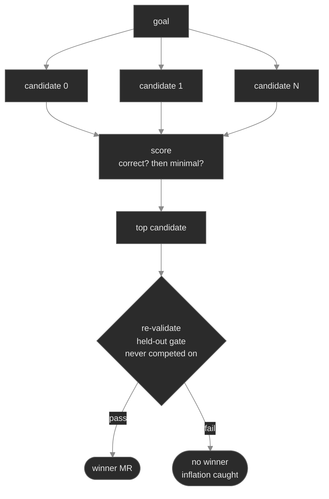

# Best-of-N (evolutionary search) — a starter guide

For a hard goal where one run isn't reliable, run **N candidates** and keep the best. loopkit's
`Supervisor.evolve` (and the `fleet evolve` tier) does this: N attempts at the same goal, each in an
isolated worktree, then **score → keep the best → re-validate → reseed**.

## The two roles you supply

- A **Scorer** — ranks a *finished* candidate's worktree (higher = fitter); the *selection* signal.
  [`score.sh`](score.sh) is a generic one: **correctness first** (the held-out oracle must pass, else
  disqualify — evolve scores every finished candidate, including ones that gave up), then
  **minimality** (smaller correct diff wins). Wire it as a `ShellScorer`; any tool that prints a float
  works — an LLM rating a diff, benchmark timing, coverage delta, …
- A **held-out re-validation gate** — re-checks the top candidate on something it **never optimized
  against or was selected on**. Make it a *distinct* held-out test from the one the candidates
  competed on (not the same acceptance oracle), or it only catches flakiness — not a non-general fix.

## Why the re-validation is the load-bearing part

Best-of-N is itself a way to overfit: with enough candidates, one gets a high *score* by luck or by
gaming the visible signal. The re-validation is the independent "is this actually a general fix"
check. If the top scorer fails it, the round reports **no winner** (inflation caught) rather than
shipping a fluke — the same held-out discipline as the acceptance gate, applied at fleet scale.

## When to reach for it

Reserve best-of-N for **hard / high-stakes** goals. If a goal is already reliable (high `pass^k` —
see [`../skills/README.md`](../skills/README.md)), N candidates mostly cost N× for the same answer —
though even then, evolve picks the *cleanest* of several correct fixes, which a single run can't.
