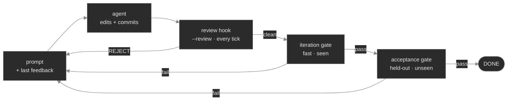

# Gates & config are fully customizable — a starter catalog

The two questions every newcomer asks: *what can a gate be?* and *how much of this do I configure?*
The answer to both is **everything**. This folder is the generic, framework-agnostic starting point —
copy [`loopkit.example.toml`](loopkit.example.toml), keep what fits, point it at any repo.

## A gate is *any shell command*

That is the entire contract — there is no gate API, no plugin, no DSL:

| The command's… | …means |
|---|---|
| **exit code 0** | the gate **passed** |
| **exit code non-zero** | the gate **failed** |
| **stdout / stderr** | the **feedback** loopkit feeds back into the next tick's prompt |

So a "gate" is whatever proves *your* notion of correct. The loop optimizes toward the **iteration**
gate every tick (fast, in-sample, deterministic) and certifies DONE with the **acceptance** gate
(held-out, run once — the two-oracle pattern, Ch 9). Mix and match freely:

```toml
[gate]
# 1. a test suite (the classic)
iteration  = "python -m pytest -q"
acceptance = "python -m pytest tests/holdout -q"

# 2. a linter / type-checker / formatter-check
# iteration = "ruff check . && mypy src"

# 3. a build (compiles cleanly = plausibly right)
# iteration = "go build ./... && go vet ./..."

# 4. a structural / content check — pure shell, no framework
# iteration = "test -f CHANGELOG.md && grep -q '## Unreleased' CHANGELOG.md"

# 5. a link / doc checker for a prose or docs repo
# iteration = "markdownlint '**/*.md' && lychee --no-progress ."

# 6. an LLM-as-judge — the held-out reviewer is itself a script that shells out to a model
# acceptance = "bash gate/review.sh"   # exits 0 on ACCEPT; rubric lives in a protected path

# 7. a Makefile target that wraps any of the above
# iteration = "make verify"
```

> **Determinism matters for the *iteration* gate.** It runs every tick, so a flaky verdict corrupts
> every stop decision — an LLM-judged check therefore never belongs in the iteration gate. Put it
> where its nondeterminism is harmless: the **acceptance** oracle for a one-shot certifier (run once),
> or the **review hook** for per-tick feedback (`--review` — see "Gate vs. review hook" below). Probe
> stability before trusting a gate: `loopkit run --check-gate 5`.

> **Calibrate a gate before you trust it.** Determinism isn't enough — a gate also has to *discriminate*.
> Run it on a known-**good** tree (it must pass) and a deliberately-**broken** one (it must fail) before
> wiring it in; a check that only ever passes is decoration. Two traps a calibration pass catches: a
> matcher that silently finds *nothing* reports a **false green** — assert it actually checked something
> (count what it matched, fail on zero) — and a check that encodes a *convention with legitimate
> exceptions* will false-fail good work. Keep only universally-true checks as hard failures; demote the
> judgment calls to warnings, or to the held-out reviewer's rubric.

## A ready-to-copy two-oracle kit

Runnable starters in this folder — copy them into a `gate/` dir, edit, and point your config at them:

| File | Role | Typical wiring |
|---|---|---|
| [`mechanical.sh`](mechanical.sh) | deterministic **verification** skeleton — drop in your tests / lint / build / structural asserts | `gate.iteration` (code) |
| [`docs-gate.sh`](docs-gate.sh) | deterministic **structural** check for a **prose/docs** repo — markdownlint (or a pure-shell fallback) + relative-link resolution | `gate.iteration` (prose) |
| [`review.sh`](review.sh) | **peer LLM review** — a second model scores the change's *diff* against a rubric it can't edit; `VERDICT: ACCEPT` → exit 0 | `gate.acceptance` |
| [`rubric.md`](rubric.md) | the grading criteria `review.sh` applies — make it task-specific | (read by `review.sh`) |

### The same pattern in two flavors

**Code repo — the test gate (a held-out test split).** The canonical two-oracle: the *iteration* gate
runs the visible tests; the *acceptance* gate runs a **held-out** split the agent can't see (SWE-bench's
FAIL_TO_PASS + PASS_TO_PASS). The runnable example is [`../demo-repo/`](../demo-repo/) — `tests/seen/`
vs `tests/holdout/`:

```toml
[gate]
iteration  = "python -m pytest tests/seen -q"      # visible — optimized every tick
acceptance = "python -m pytest tests/holdout -q"   # held-out — certifies DONE (catches overfit)
[safety]
protected_paths = ["tests/"]                       # the agent may not edit either split
```

**Prose / docs repo — structural + peer review.** When the artifact is Markdown, structure is the
deterministic check and substance is the held-out one:

```toml
[gate]
iteration  = "bash gate/docs-gate.sh"     # structure + links — deterministic, every tick
acceptance = "bash gate/review.sh"          # peer LLM review of substance — held-out, once
[safety]
protected_paths = ["gate/"]                # so a run can't weaken docs-gate.sh, review.sh, OR rubric.md
```

`review.sh` is the *generic* shape of the held-out reviewer: it diffs the run's change against the base
branch and asks a fresh `claude` to judge it by the rubric — "a second model you don't control certifies
the work," nothing task-specific baked in. (Note: in a **keyless CI/cloud** context the gate's `claude`
call may have no credential — there the **draft PR + a human reviewer** is the clean held-out oracle;
see [`../ci/`](../ci/).)

## Gate vs. review hook — the same judge, two wirings

An LLM reviewer like [`review.sh`](review.sh) can be wired **two ways**, and they behave very
differently:

- As the **acceptance gate** (`acceptance = "bash gate/review.sh"`) — runs **once**, after the
  iteration gate passes, as the held-out oracle. Nondeterministic, so it belongs here, never as the
  per-tick iteration gate.
- As the **review hook** (`run --review "bash gate/review.sh"`) — runs **after every tick's commit**,
  *before* the gates. A non-zero verdict blocks DONE and its reasons feed back as the next tick's
  input, so the agent fixes review findings while the producing context is still fresh.



Same script, same rubric — the wiring decides whether it's a one-shot certifier at the end or a
per-tick collaborator that shapes the change as it's built. A common setup uses the hook *during*
the run **and** a held-out acceptance oracle for the final DONE decision.

## Before the loop: `--validate`

[`validate.sh`](validate.sh) is a **pre-loop** check (`run --validate <cmd>`): it runs before the
agent and aborts the run (exit 3, nothing spent) if the goal no longer reproduces — e.g. the
acceptance oracle *already passes*, so the work is already done. It's the fail-first check, automated
as a preflight: the mirror image of the acceptance gate (there the oracle must pass to finish; here it
must fail to start).

## Beyond one loop: best-of-N

For hard goals, [`../evolve/`](../evolve/) runs N candidates and keeps the best — with a scorer
([`../evolve/score.sh`](../evolve/score.sh)) and a **separate held-out re-validation gate** so a
lucky candidate that gamed the score can't win.

## …and the config is the whole loop, declaratively

Every other knob is in the same file — the goal, the fixed-context anchors, the budget + adapter,
the three hard stops, and the **safety envelope** (protected paths, branch allow/deny, clean-tree).
[`loopkit.example.toml`](loopkit.example.toml) annotates all of them. Start there, or scaffold a
minimal one with `loopkit init`, then tighten gate-by-gate.

**Protect your verifier.** Put the gate's files (`tests/`, `gate/`, an `evals.py`) under
`safety.protected_paths` so a run can't "pass" by weakening its own grader (Ch 9 — verifier hacking).
That single line is what makes an autonomous gate trustworthy.

**A gate only sees what it can observe.** An offline/static gate can't judge *rendered* or *runtime*
correctness — an artifact can pass every check and still be visually broken or wrong when it runs.
Either add a check that actually exercises it (render it to an image and diff, boot it and hit it,
snapshot the output) or lean on the held-out reviewer plus a human. "Passes the gate" is only ever as
strong as what the gate is able to look at.
