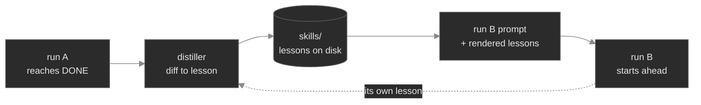

# Reliability (pass^k) & the skills flywheel — a starter guide

Two questions that come after "does the loop solve this once?": **how *reliably* does it solve it?**
and **can earlier solves make later ones easier?** loopkit answers both with the same primitives you
already use — a held-out gate and a shell command.

## 1. Calibrate reliability before you trust a batch — `measure`

`measure` runs the goal N independent times and reports two curves, both graded by the **held-out
acceptance gate** (a trial "passes" only when that gate certifies DONE):

- **pass^k** (reliability, falls with k) — did it succeed on *every* one of k attempts? This is the
  production question. `pass^3 = 100%` means three-for-three; `pass^3 = 33%` means it's a coin-flip.
- **pass@k** (discovery, rises with k) — *could* it do it within k tries? This is what `evolve` optimizes.

```bash
# Calibrate against the REAL task — source the goal from an issue, same as `run`:
loopkit measure --config task.toml --repo ./workspace --from-issue 42 --provider gitlab -n 5
```

The report carries the loopkit version + a harness signature + a timestamp — *a number without its
harness isn't a measurement*. Use it to decide which goal-kinds are safe to run unattended (high
pass^k) versus which need a human in the loop (low pass^k) — before you spend a batch finding out.

> `--from-issue` makes calibration measure the exact goal `run` will use. Without it, `measure` falls
> back to the config's `goal` field — fine for a self-contained `loopkit.toml`, wrong if your config
> carries a placeholder goal that a per-run `--from-issue` overrides.

## 2. Let solves compound — the skills flywheel

A skill is a short, reusable lesson distilled from a solved run and rendered into future prompts.
Point successive runs at the same `--skills` directory and learning accumulates on disk:




```bash
loopkit run --config task.toml --from-issue 42 \
  --skills ./skills \
  --skills-distiller "GATE_BASE=origin/main bash examples/skills/distill.sh"
```

- **`--skills <dir>`** — a `FileSkillRegistry`: every `*.md` lesson in the dir is rendered into each
  tick's prompt; a new one is written back on DONE. A fresh process pointed at the same dir inherits
  every prior lesson.
- **`--skills-distiller <cmd>`** — a `ShellDistiller`: after DONE, this command turns the solved diff
  into ONE general lesson (its stdout). Omit it for provenance-only default distillation.
  [`distill.sh`](distill.sh) is a generic example (a headless LLM summarizing the diff into a reusable
  technique). Symmetric with the `--review` judge: any tool can produce the lesson.

Write-back is **gated and sanitized**: a run can be acceptable yet unfit to learn from, and a
distilled lesson is length-bounded + secret-scrubbed before it is ever stored or rendered. Because a
goal can be attacker-influenced (an issue body), **namespace the skills home per tenant** (a separate
`--skills` dir / `--skills-repo`) so a poisoned lesson only re-enters its own runs.

### When each pays off

- **`measure`** — before trusting *any* new goal-kind unattended; cheap insurance against a flaky path.
- **skills** — across *many similar* goals (a sweep of one bug-class, a migration over many files),
  where the first solve's technique is exactly what the next one needs. Little benefit on a handful of
  unrelated one-offs — the rendered lessons are then just prompt weight.
